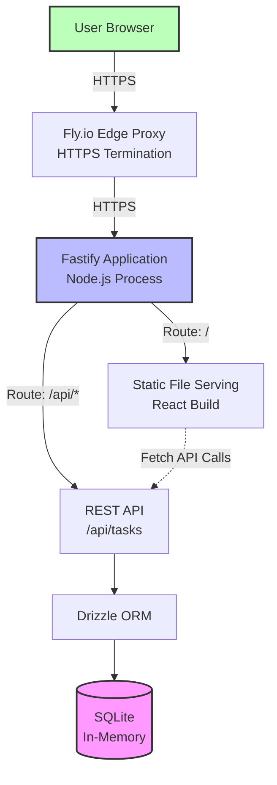
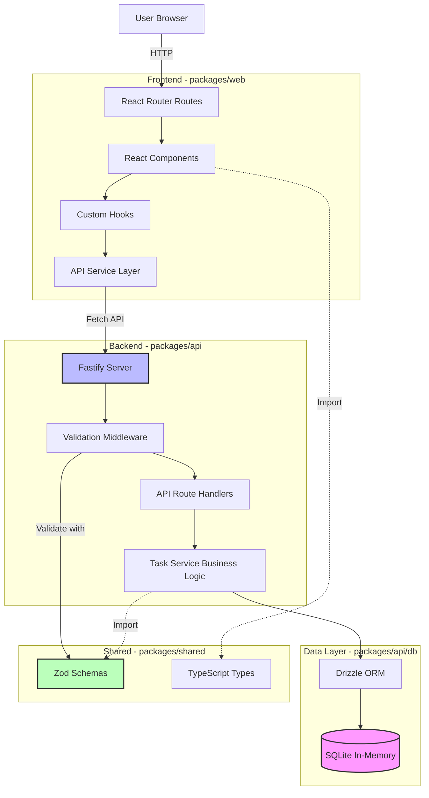
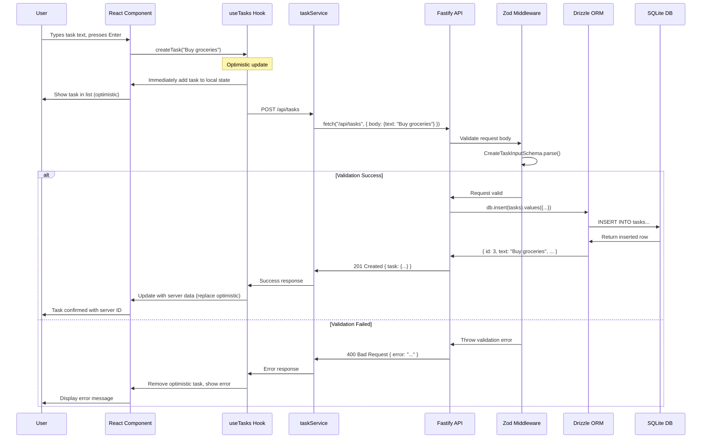
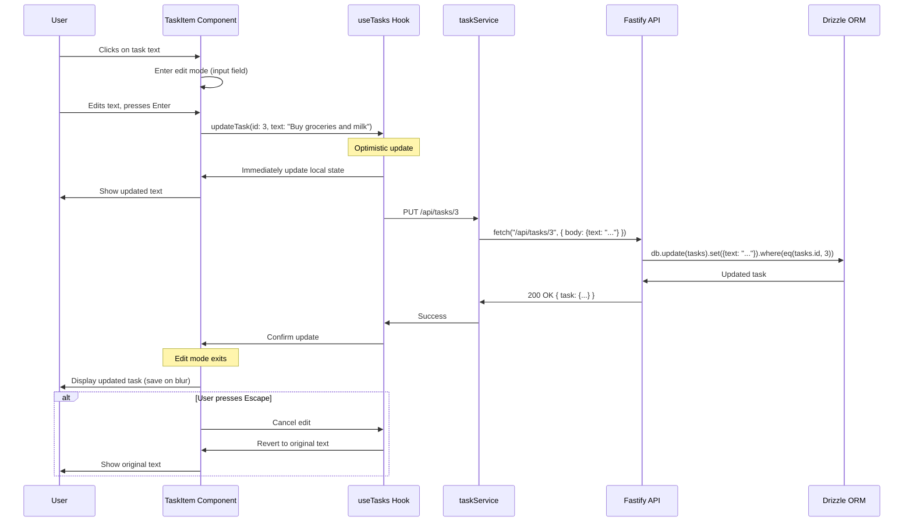
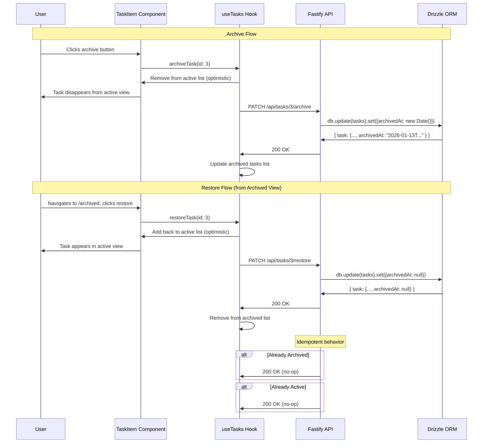
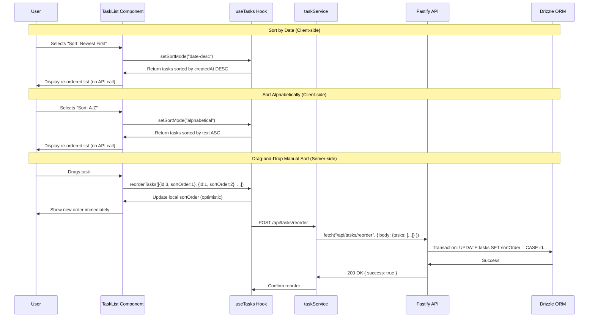
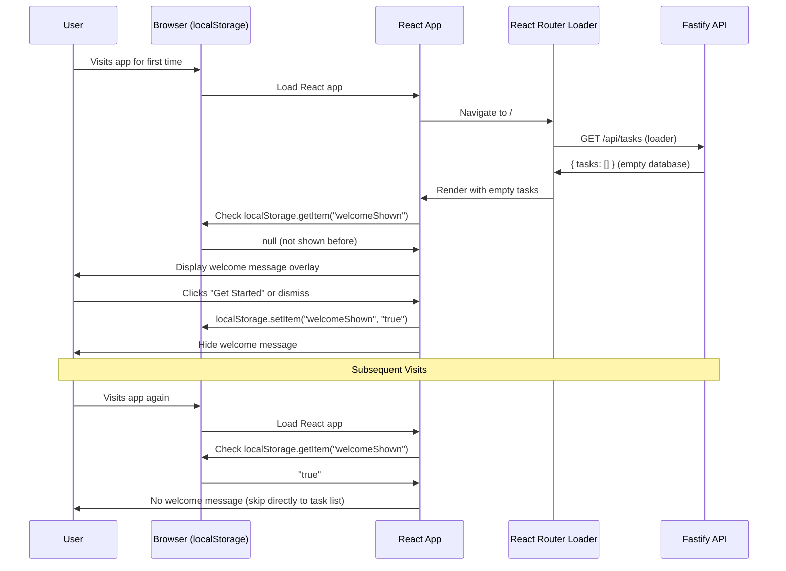
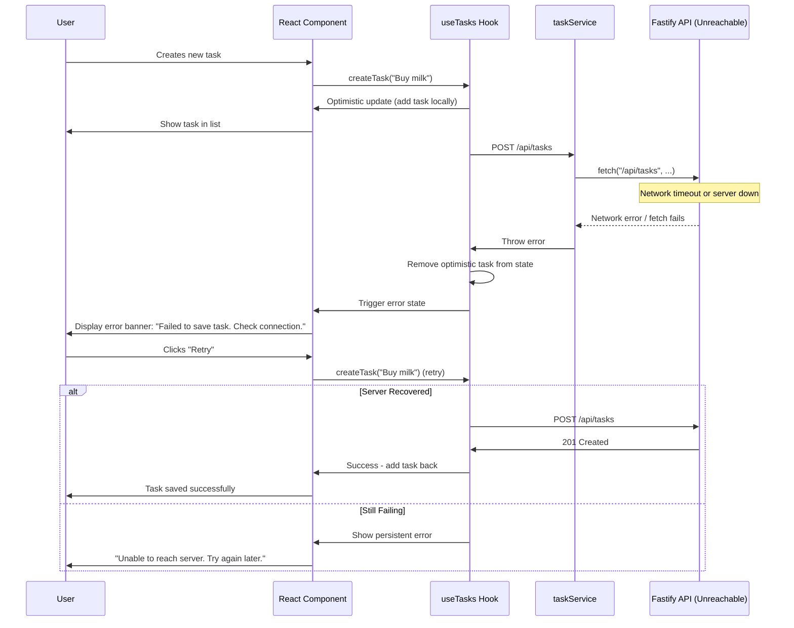
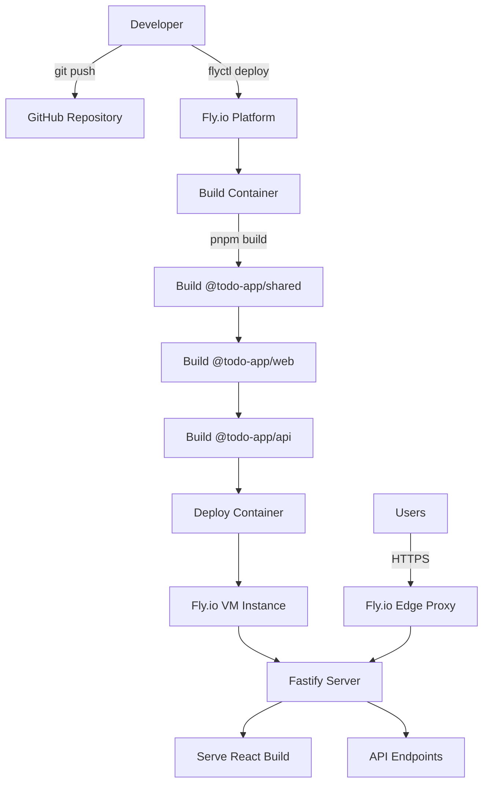
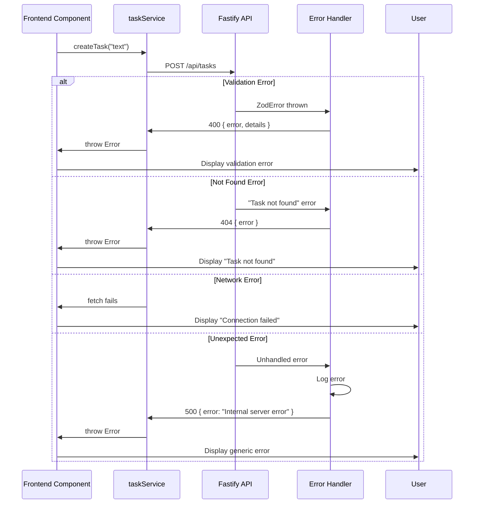

# Simple To-Do App to Demonstrate the BMAD Method Fullstack Architecture Document

## Introduction

This document outlines the complete fullstack architecture for **Simple To-Do App (BMAD Method Demonstration)**, including backend systems, frontend implementation, and their integration. It serves as the single source of truth for AI-driven development, ensuring consistency across the entire technology stack.

This unified approach combines what would traditionally be separate backend and frontend architecture documents, streamlining the development process for modern fullstack applications where these concerns are increasingly intertwined.

**Architecture Philosophy for This Project:**

Given the unique 2-hour build constraint, this architecture prioritizes:
- **Radical Simplicity:** Monolithic architecture with in-memory database eliminates infrastructure complexity
- **Zero Configuration Overhead:** Leveraging platform defaults (Fly.io HTTPS, React's built-in security) over custom implementations
- **Type Safety Across Stack:** Shared TypeScript types between frontend and backend prevent integration issues
- **Portfolio-First Design:** Clean, readable code structure that demonstrates architectural thinking, not just functionality

The architecture balances demonstrating best practices (ORM usage, validation, responsive design) with pragmatic shortcuts necessitated by time constraints (in-memory DB, manual testing, no auth).

### Starter Template or Existing Project

**N/A - Greenfield project**

This is a greenfield project with no starter template. We'll build the monorepo structure from scratch using pnpm workspaces, optimized for the 2-hour delivery constraint.

### Change Log

| Date | Version | Description | Author |
|------|---------|-------------|--------|
| 2026-01-13 | v1.0 | Initial architecture document creation | Winston (Architect) |

## High Level Architecture

### Technical Summary

This application follows a **monolithic fullstack architecture** deployed as a single unit to Fly.io. The frontend is a React 19 single-page application built with Vite and React Router v7, served as static files from the Fastify backend. The backend exposes a RESTful API built with Fastify, using Drizzle ORM to interface with an SQLite in-memory database. This architecture eliminates all external service dependencies—no separate database server, no CDN configuration, no authentication provider—enabling complete deployment in under 5 minutes. The monorepo structure with pnpm workspaces ensures shared TypeScript types between frontend and backend, providing end-to-end type safety across API boundaries. This design achieves the PRD's primary goal: demonstrating that structured methodology (BMAD) combined with pragmatic architectural choices enables rapid delivery of clean, functional software.

### Platform and Infrastructure Choice

Based on the 2-hour delivery constraint and portfolio demonstration goals, here are the viable options:

**Option 1: Fly.io (RECOMMENDED)**
- ✅ Zero-config HTTPS and global edge deployment
- ✅ Single `flyctl deploy` command deploys entire monolith
- ✅ Free tier sufficient for demo app ($0/month)
- ✅ Automatic health checks and restarts
- ❌ Data doesn't persist across deploys (acceptable for in-memory demo)

**Option 2: Vercel**
- ✅ Excellent DX for React deployments
- ✅ Automatic preview deployments
- ❌ Requires separate backend deployment (Vercel Serverless Functions or external API)
- ❌ Serverless architecture adds complexity vs simple Node.js server

**Option 3: Railway/Render**
- ✅ Similar simplicity to Fly.io
- ❌ Slightly more configuration overhead
- ❌ Less generous free tier

**Decision: Fly.io**

The PRD pre-selected Fly.io, and it's the optimal choice for this use case. Deploying a single Node.js process with embedded frontend is Fly.io's sweet spot.

**Platform:** Fly.io
**Key Services:**
- Fly.io compute (single VM instance)
- Automatic HTTPS via Fly.io edge proxy
- Built-in health checks and monitoring

**Deployment Host and Regions:**
- Primary region: `iad` (US East - Ashburn, Virginia) for minimal latency to likely audience
- Single region deployment (no multi-region complexity for MVP)

### Repository Structure

**Structure:** Monorepo with pnpm workspaces

**Monorepo Tool:** pnpm workspaces (fast, disk-efficient, strict dependency management)

**Package Organization:**
```
root/
├── packages/
│   ├── web/          # Frontend application (React + Vite)
│   ├── api/          # Backend application (Fastify + Drizzle)
│   └── shared/       # Shared TypeScript types and constants
├── pnpm-workspace.yaml  # Workspace configuration
├── package.json         # Root package.json
└── docs/               # BMAD documentation (PRD, architecture, stories)
```

**Rationale:**
- **pnpm over npm/yarn:** 3x faster installs, disk-efficient via content-addressable storage, strict node_modules prevents phantom dependencies
- **pnpm over Turborepo/Nx:** Workspace management only, no build orchestration overhead - critical for 2-hour constraint
- **Three-package structure:** Separates frontend, backend, and shared concerns without over-engineering
- **Shared package:** Enables importing `@todo-app/shared` types in both web and api packages, ensuring API contracts stay synchronized
- **Collocated docs:** Documentation lives in same repo as code, making this a complete portfolio artifact

### High Level Architecture Diagram



**Diagram Explanation:**
- Single Node.js process handles both static frontend and API requests
- Fly.io edge proxy provides HTTPS termination and routing
- Frontend makes client-side API calls to `/api/*` endpoints on same origin (no CORS complexity)
- In-memory database runs within the Node.js process (highlighted in pink to emphasize ephemeral nature)

### Architectural Patterns

- **Monolithic Architecture:** Single deployable unit containing frontend, backend, and database - _Rationale:_ Eliminates deployment orchestration complexity, enables 2-hour delivery, simplifies development workflow
- **Single-Page Application (SPA):** Client-side rendering with React Router for navigation - _Rationale:_ Provides instant UI feedback and smooth interactions aligned with PRD's "immediate feedback" requirement
- **RESTful API:** Standard HTTP methods (GET, POST, PUT, DELETE) for CRUD operations - _Rationale:_ Simple, well-understood pattern; no GraphQL or tRPC learning curve; sufficient for straightforward entity operations
- **Repository Pattern:** Drizzle ORM abstracts database access behind typed query interface - _Rationale:_ Enables future database migration (in-memory → file-based → PostgreSQL) without rewriting business logic
- **Optimistic UI Updates:** Frontend immediately reflects changes before server confirmation - _Rationale:_ Achieves <100ms perceived latency (NFR2) by not blocking UI on network round trips
- **API-First Component Design:** React components consume backend data exclusively via API layer, never directly accessing business logic - _Rationale:_ Maintains clean separation of concerns, enables future mobile client or API consumers
- **Shared Type Definitions:** TypeScript interfaces defined once in `@todo-app/shared`, imported by both frontend and API - _Rationale:_ Prevents drift between API contracts and frontend expectations, catch integration bugs at compile time

## Tech Stack

### Technology Stack Table

| Category | Technology | Version | Purpose | Rationale |
|----------|-----------|---------|---------|-----------|
| Frontend Language | TypeScript | 5.7.x | Type-safe JavaScript for frontend development | Catches type errors at compile time, enables refactoring confidence, improves IDE autocomplete |
| Frontend Framework | React | 19.x | UI component library with modern hooks and concurrent features | Industry standard, excellent ecosystem, React 19 brings improved server components and concurrent rendering |
| UI Component Library | None (Custom CSS) | N/A | Minimal styling without component library overhead | Keeps bundle size minimal (<200KB target), demonstrates CSS skills, avoids learning shadcn/MUI/Chakra |
| State Management | React useState + React Router | Built-in | Local component state and URL-driven global state | No Redux/Zustand needed for simple CRUD - React Router loaders/actions handle data fetching patterns |
| Backend Language | TypeScript | 5.7.x | Type-safe JavaScript for backend development | Shared language between frontend/backend, type safety for API logic |
| Backend Framework | Fastify | 5.2.x | High-performance Node.js web framework | 2x faster than Express, modern async/await patterns, excellent TypeScript support, schema validation built-in |
| Validation Library | Zod | 3.24.x | TypeScript-first schema validation library | Runtime validation, type inference, OpenAPI generation via @fastify/type-provider-zod |
| API Style | REST | N/A | RESTful HTTP endpoints for CRUD operations | Simple, well-understood, no learning curve; sufficient for straightforward entity operations |
| Database | SQLite | 3.x (better-sqlite3) | Embedded SQL database running in-memory | Zero infrastructure setup, SQL familiarity, easy migration path to persistent file or PostgreSQL |
| ORM | Drizzle ORM | 0.39.x | Type-safe database queries and migrations | Lightweight (vs Prisma), generates TypeScript types from schema, supports migrations, no runtime overhead |
| Cache | None | N/A | No caching layer for MVP | In-memory database is already fast enough (<50ms API response target); caching adds complexity |
| File Storage | None | N/A | No file upload functionality in MVP | Out of scope per PRD requirements |
| Authentication | None | N/A | No authentication for MVP | Explicitly excluded per NFR10 - single-user shared state application |
| Frontend Testing | None (Manual) | N/A | Manual testing only for MVP | 2-hour constraint eliminates automated test development time |
| Backend Testing | None (Manual) | N/A | Manual testing only for MVP | 2-hour constraint eliminates automated test development time |
| E2E Testing | None (Manual) | N/A | Manual browser testing only | 2-hour constraint eliminates Playwright/Cypress setup time |
| Package Manager | pnpm | 9.x | Fast, disk-efficient package manager with workspace support | 3x faster than npm, content-addressable storage saves disk space, strict node_modules prevents phantom dependencies |
| Build Tool | Vite | 6.x | Frontend build tool and dev server | Fastest dev server, optimized production builds, native ESM, excellent TypeScript support |
| Bundler | Rollup (via Vite) | Built-in | Production bundler for frontend | Vite uses Rollup under the hood; best-in-class tree shaking and code splitting |
| IaC Tool | None (Fly.io CLI) | N/A | Infrastructure via Fly.io dashboard and flyctl | No Terraform/Pulumi needed - Fly.io's `fly.toml` configuration is sufficient |
| CI/CD | None (Manual Deploy) | N/A | Manual deployment via flyctl for MVP | GitHub Actions setup would consume 15-20 minutes of 2-hour window |
| Monitoring | Fly.io Metrics | Built-in | Basic request metrics and health checks | Fly.io provides basic monitoring; no Datadog/New Relic needed for demo |
| Logging | Console (stdout) | Built-in | Structured logging to stdout, captured by Fly.io | Fastify's built-in logger (Pino) outputs JSON logs; Fly.io captures and displays them |
| CSS Framework | Vanilla CSS | N/A | Custom CSS with CSS variables for theming | No Tailwind setup time, demonstrates CSS fundamentals, sufficient for minimal UI |

## Data Models

### Task

**Purpose:** Represents a single to-do item in the application, supporting all CRUD operations, archival workflow, and sorting capabilities defined in the PRD (FR1-FR5).

**Key Attributes:**
- `id`: `number` - Auto-incrementing primary key, uniquely identifies each task
- `text`: `string` - Task description/content entered by user, required field with 1-500 character limit
- `createdAt`: `Date` - Timestamp when task was created, used for date-based sorting (FR5)
- `archivedAt`: `Date | null` - Nullable timestamp; `null` = active task, non-null = archived task with archive time (FR3, FR4)
- `sortOrder`: `number` - Integer for manual drag-and-drop ordering, allows user-defined sequence (FR5)

#### TypeScript Interface

```typescript
// packages/shared/src/types/task.ts
export interface Task {
  id: number;
  text: string;
  createdAt: Date;
  archivedAt: Date | null;
  sortOrder: number;
}

// Type for creating a new task (omit id, timestamps, sortOrder - set by backend)
export type CreateTaskInput = {
  text: string;
};

// Type for updating a task (text only - use /reorder for sortOrder changes)
export type UpdateTaskInput = {
  text: string;
};

// Type for reordering tasks
export type ReorderTasksInput = {
  tasks: Array<{ id: number; sortOrder: number }>;
};
```

#### Zod Schemas for Validation

```typescript
// packages/shared/src/schemas/task.schema.ts
import { z } from 'zod';

// Task schema
export const TaskSchema = z.object({
  id: z.number().int().positive(),
  text: z.string().min(1).max(500),
  createdAt: z.date(),
  archivedAt: z.date().nullable(),
  sortOrder: z.number().int().nonnegative(),
});

// Create task input schema
export const CreateTaskInputSchema = z.object({
  text: z.string().min(1, 'Task text is required').max(500, 'Task text must be 500 characters or less').trim(),
});

// Update task input schema (text only)
export const UpdateTaskInputSchema = z.object({
  text: z.string().min(1, 'Task text is required').max(500, 'Task text must be 500 characters or less').trim(),
});

// Reorder tasks input schema
export const ReorderTasksInputSchema = z.object({
  tasks: z.array(
    z.object({
      id: z.number().int().positive(),
      sortOrder: z.number().int().nonnegative(),
    })
  ).min(1, 'At least one task required for reordering'),
});

// Infer TypeScript types from Zod schemas
export type Task = z.infer<typeof TaskSchema>;
export type CreateTaskInput = z.infer<typeof CreateTaskInputSchema>;
export type UpdateTaskInput = z.infer<typeof UpdateTaskInputSchema>;
export type ReorderTasksInput = z.infer<typeof ReorderTasksInputSchema>;
```

**Note:** These Zod schemas serve dual purposes:
1. Runtime validation in Fastify routes (via @fastify/type-provider-zod)
2. OpenAPI schema generation (via @fastify/swagger with Zod support)

#### Relationships

- No relationships - single-table design
- Future extension points (not in MVP):
  - Could add `User` entity (one-to-many: User → Tasks) when authentication is added
  - Could add `Tag` entity (many-to-many: Tasks ↔ Tags) for categorization
  - Could add `Project` entity (one-to-many: Project → Tasks) for grouping

## API Specification

### REST API Specification

```yaml
openapi: 3.0.0
info:
  title: Simple To-Do App API
  version: 1.0.0
  description: RESTful API for task management supporting CRUD operations, archival, and sorting. All endpoints use Zod schemas for validation and OpenAPI generation.
servers:
  - url: http://localhost:3000/api
    description: Local development server
  - url: https://todo-bmad-demo.fly.dev/api
    description: Production server (Fly.io)

paths:
  /health:
    get:
      summary: Health check endpoint
      description: Returns 200 if API and database are operational. Used by Fly.io for health monitoring.
      operationId: healthCheck
      tags:
        - System
      responses:
        '200':
          description: Service is healthy
          content:
            application/json:
              schema:
                type: object
                properties:
                  status:
                    type: string
                    example: "ok"
                  timestamp:
                    type: string
                    format: date-time
                    example: "2026-01-13T15:00:00.000Z"
                  database:
                    type: string
                    example: "connected"
        '503':
          description: Service is unhealthy
          content:
            application/json:
              schema:
                type: object
                properties:
                  status:
                    type: string
                    example: "error"
                  error:
                    type: string
                    example: "Database connection failed"

  /tasks:
    get:
      summary: Get all tasks
      description: Returns all tasks (both active and archived). Frontend filters by archivedAt field. Limited to 1000 tasks maximum.
      operationId: getTasks
      tags:
        - Tasks
      parameters:
        - name: archived
          in: query
          description: Filter by archived status (true = archived only, false = active only, omit = all)
          required: false
          schema:
            type: boolean
      responses:
        '200':
          description: List of tasks (max 1000 returned)
          content:
            application/json:
              schema:
                type: object
                properties:
                  tasks:
                    type: array
                    items:
                      $ref: '#/components/schemas/Task'
              example:
                tasks:
                  - id: 1
                    text: "Build monorepo structure"
                    createdAt: "2026-01-13T10:00:00.000Z"
                    archivedAt: null
                    sortOrder: 1
                  - id: 2
                    text: "Deploy to Fly.io"
                    createdAt: "2026-01-13T10:05:00.000Z"
                    archivedAt: null
                    sortOrder: 2
        '500':
          $ref: '#/components/responses/InternalServerError'

    post:
      summary: Create a new task
      description: Creates a new task with auto-generated id, createdAt, and sortOrder. Validated with CreateTaskInputSchema.
      operationId: createTask
      tags:
        - Tasks
      requestBody:
        required: true
        content:
          application/json:
            schema:
              $ref: '#/components/schemas/CreateTaskInput'
            example:
              text: "Write architecture documentation"
      responses:
        '201':
          description: Task created successfully
          content:
            application/json:
              schema:
                type: object
                properties:
                  task:
                    $ref: '#/components/schemas/Task'
              example:
                task:
                  id: 3
                  text: "Write architecture documentation"
                  createdAt: "2026-01-13T10:10:00.000Z"
                  archivedAt: null
                  sortOrder: 3
        '400':
          $ref: '#/components/responses/BadRequest'
        '500':
          $ref: '#/components/responses/InternalServerError'

  /tasks/{id}:
    get:
      summary: Get a single task by ID
      description: Returns a specific task by its ID
      operationId: getTaskById
      tags:
        - Tasks
      parameters:
        - name: id
          in: path
          required: true
          description: Task ID
          schema:
            type: integer
      responses:
        '200':
          description: Task found
          content:
            application/json:
              schema:
                type: object
                properties:
                  task:
                    $ref: '#/components/schemas/Task'
        '404':
          $ref: '#/components/responses/NotFound'
        '500':
          $ref: '#/components/responses/InternalServerError'

    put:
      summary: Update task text
      description: Updates task text only. For sortOrder changes, use POST /tasks/reorder. Validated with UpdateTaskInputSchema.
      operationId: updateTask
      tags:
        - Tasks
      parameters:
        - name: id
          in: path
          required: true
          description: Task ID
          schema:
            type: integer
      requestBody:
        required: true
        content:
          application/json:
            schema:
              $ref: '#/components/schemas/UpdateTaskInput'
            example:
              text: "Build monorepo structure (completed)"
      responses:
        '200':
          description: Task updated successfully
          content:
            application/json:
              schema:
                type: object
                properties:
                  task:
                    $ref: '#/components/schemas/Task'
        '400':
          $ref: '#/components/responses/BadRequest'
        '404':
          $ref: '#/components/responses/NotFound'
        '500':
          $ref: '#/components/responses/InternalServerError'

    delete:
      summary: Delete a task permanently
      description: Hard deletes a task from the database (not used in MVP UI, but available for future cleanup)
      operationId: deleteTask
      tags:
        - Tasks
      parameters:
        - name: id
          in: path
          required: true
          description: Task ID
          schema:
            type: integer
      responses:
        '204':
          description: Task deleted successfully (no content)
        '404':
          $ref: '#/components/responses/NotFound'
        '500':
          $ref: '#/components/responses/InternalServerError'

  /tasks/{id}/archive:
    patch:
      summary: Archive a task
      description: Sets archivedAt to current timestamp, moving task out of active view. Idempotent - archiving an already-archived task returns 200 with no changes.
      operationId: archiveTask
      tags:
        - Tasks
      parameters:
        - name: id
          in: path
          required: true
          description: Task ID
          schema:
            type: integer
      responses:
        '200':
          description: Task archived successfully (or already archived)
          content:
            application/json:
              schema:
                type: object
                properties:
                  task:
                    $ref: '#/components/schemas/Task'
              example:
                task:
                  id: 1
                  text: "Build monorepo structure"
                  createdAt: "2026-01-13T10:00:00.000Z"
                  archivedAt: "2026-01-13T14:30:00.000Z"
                  sortOrder: 1
        '404':
          $ref: '#/components/responses/NotFound'
        '500':
          $ref: '#/components/responses/InternalServerError'

  /tasks/{id}/restore:
    patch:
      summary: Restore an archived task
      description: Sets archivedAt to null, returning task to active view. Idempotent - restoring an already-active task returns 200 with no changes.
      operationId: restoreTask
      tags:
        - Tasks
      parameters:
        - name: id
          in: path
          required: true
          description: Task ID
          schema:
            type: integer
      responses:
        '200':
          description: Task restored successfully (or already active)
          content:
            application/json:
              schema:
                type: object
                properties:
                  task:
                    $ref: '#/components/schemas/Task'
              example:
                task:
                  id: 1
                  text: "Build monorepo structure"
                  createdAt: "2026-01-13T10:00:00.000Z"
                  archivedAt: null
                  sortOrder: 1
        '404':
          $ref: '#/components/responses/NotFound'
        '500':
          $ref: '#/components/responses/InternalServerError'

  /tasks/reorder:
    post:
      summary: Reorder multiple tasks
      description: Batch update sortOrder for multiple tasks (used for drag-and-drop). This is the ONLY endpoint for modifying sortOrder. Validated with ReorderTasksInputSchema.
      operationId: reorderTasks
      tags:
        - Tasks
      requestBody:
        required: true
        content:
          application/json:
            schema:
              $ref: '#/components/schemas/ReorderTasksInput'
            example:
              tasks:
                - id: 3
                  sortOrder: 1
                - id: 1
                  sortOrder: 2
                - id: 2
                  sortOrder: 3
      responses:
        '200':
          description: Tasks reordered successfully
          content:
            application/json:
              schema:
                type: object
                properties:
                  success:
                    type: boolean
                    example: true
        '400':
          $ref: '#/components/responses/BadRequest'
        '500':
          $ref: '#/components/responses/InternalServerError'

components:
  schemas:
    Task:
      type: object
      description: Corresponds to TaskSchema in packages/shared/src/schemas/task.schema.ts
      properties:
        id:
          type: integer
          example: 1
        text:
          type: string
          minLength: 1
          maxLength: 500
          example: "Build monorepo structure"
        createdAt:
          type: string
          format: date-time
          example: "2026-01-13T10:00:00.000Z"
        archivedAt:
          type: string
          format: date-time
          nullable: true
          example: null
        sortOrder:
          type: integer
          minimum: 0
          example: 1
      required:
        - id
        - text
        - createdAt
        - archivedAt
        - sortOrder

    CreateTaskInput:
      type: object
      description: Corresponds to CreateTaskInputSchema in packages/shared/src/schemas/task.schema.ts
      properties:
        text:
          type: string
          minLength: 1
          maxLength: 500
          example: "Write API documentation"
      required:
        - text

    UpdateTaskInput:
      type: object
      description: Corresponds to UpdateTaskInputSchema in packages/shared/src/schemas/task.schema.ts
      properties:
        text:
          type: string
          minLength: 1
          maxLength: 500
          example: "Updated task text"
      required:
        - text

    ReorderTasksInput:
      type: object
      description: Corresponds to ReorderTasksInputSchema in packages/shared/src/schemas/task.schema.ts
      properties:
        tasks:
          type: array
          minItems: 1
          items:
            type: object
            properties:
              id:
                type: integer
                minimum: 1
              sortOrder:
                type: integer
                minimum: 0
            required:
              - id
              - sortOrder
      required:
        - tasks

  responses:
    BadRequest:
      description: Invalid request (validation error)
      content:
        application/json:
          schema:
            type: object
            properties:
              error:
                type: string
                example: "Validation failed: text must be between 1 and 500 characters"

    NotFound:
      description: Resource not found
      content:
        application/json:
          schema:
            type: object
            properties:
              error:
                type: string
                example: "Task not found"

    InternalServerError:
      description: Internal server error
      content:
        application/json:
          schema:
            type: object
            properties:
              error:
                type: string
                example: "Internal server error"

  securitySchemes: {}
```

### API Implementation with Zod

The API uses **@fastify/type-provider-zod** to automatically validate requests and generate OpenAPI documentation from Zod schemas:

```typescript
// packages/api/src/routes/tasks.ts (example route)
import { FastifyPluginAsync } from 'fastify';
import { CreateTaskInputSchema, TaskSchema } from '@todo-app/shared/schemas/task.schema';

export const tasksRoutes: FastifyPluginAsync = async (fastify) => {
  // POST /api/tasks - Create task with Zod validation
  fastify.post('/tasks', {
    schema: {
      body: CreateTaskInputSchema,
      response: {
        201: z.object({
          task: TaskSchema,
        }),
      },
    },
  }, async (request, reply) => {
    const { text } = request.body; // TypeScript knows text is string (1-500 chars)
    // Implementation...
  });
};
```

**Benefits:**
- ✅ Single source of truth (Zod schemas) for validation and OpenAPI
- ✅ Runtime validation prevents invalid data from reaching business logic
- ✅ TypeScript inference from schemas eliminates manual type definitions
- ✅ OpenAPI docs auto-generated and always in sync with code

### Key API Design Decisions

**1. Health Check Endpoint:** `/health` returns database connectivity status for Fly.io monitoring. If SQLite connection fails, returns 503, triggering instance restart.

**2. Idempotent Archive/Restore:** Calling `/tasks/1/archive` on an already-archived task returns 200 (no-op), not 400. Simplifies frontend logic - no need to check state before action.

**3. Separate Reorder Endpoint:** Removed `sortOrder` from PUT endpoint. Use `POST /tasks/reorder` exclusively for position changes. Clear separation: PUT = edit text, POST /reorder = change position.

**4. Max 1000 Tasks:** GET /tasks limits response to first 1000 tasks sorted by sortOrder. Known limitation documented - pagination is post-MVP enhancement.

**5. Consistent Response Wrapping:** All responses wrap data in objects (`{ task }`, `{ tasks }`), never bare arrays. Enables future metadata additions without breaking changes.

### Known Limitations (MVP Scope)

- ❌ **No pagination:** GET /tasks returns max 1000 items
- ❌ **No API versioning:** Paths are `/api/tasks`, not `/api/v1/tasks`
- ❌ **Simple error responses:** Error objects are strings, not structured codes
- ❌ **No rate limiting documentation:** Fastify plugin enforces 100 req/min but not in OpenAPI spec
- ❌ **No CORS headers:** Same-origin only (frontend served from same server)

## Components

### Frontend Web Application

**Responsibility:** User-facing React application providing task management interface with inline editing, archival workflow, and multiple sorting options.

**Key Interfaces:**
- Exposes public routes: `/` (main task list), `/archived` (archived tasks view)
- Consumes REST API: `GET /api/tasks`, `POST /api/tasks`, `PUT /api/tasks/:id`, etc.
- Renders responsive UI: desktop (1280px+), tablet (768-1024px), mobile (375-767px)

**Dependencies:**
- API Service Layer (for backend communication)
- Shared Types/Schemas package (TypeScript interfaces and Zod schemas)

**Technology Stack:**
- React 19 with TypeScript
- React Router v7 (routing + data loaders)
- Vite (dev server + production bundler)
- Vanilla CSS with CSS variables

**Internal Structure:**
```
packages/web/src/
├── components/          # React UI components
│   ├── TaskList.tsx    # Main active task list
│   ├── TaskItem.tsx    # Individual task with inline edit
│   ├── AddTask.tsx     # New task input form
│   ├── ArchivedTasks.tsx # Archived tasks view
│   └── WelcomeMessage.tsx # First-time visitor banner
├── services/           # API client services
│   └── taskService.ts  # Fetch wrappers for /api/tasks
├── hooks/              # Custom React hooks
│   ├── useTasks.ts     # Task data fetching/caching
│   └── useOptimisticUpdate.ts # Optimistic UI updates
├── routes/             # React Router route components
│   ├── root.tsx        # Main layout
│   └── index.tsx       # Task list route with loader
├── styles/             # CSS files
│   ├── global.css      # CSS reset + variables
│   └── components/     # Component-specific styles
└── utils/              # Frontend utilities
    └── dateFormat.ts   # Date formatting helpers
```

### API Backend Service

**Responsibility:** RESTful API server providing task CRUD operations, validation, database persistence, and static file serving for frontend.

**Key Interfaces:**
- Exposes REST API: `/api/tasks/*` endpoints with JSON responses
- Exposes health check: `/health` for monitoring
- Serves static files: `/*` routes serve React build artifacts

**Dependencies:**
- Database Layer (Drizzle ORM)
- Shared Types/Schemas package (Zod validation schemas)

**Technology Stack:**
- Fastify 5.2.x with TypeScript
- @fastify/type-provider-zod (schema validation)
- @fastify/static (serve React build)
- @fastify/rate-limit (API protection)
- Pino (structured logging)

**Internal Structure:**
```
packages/api/src/
├── routes/             # API route handlers
│   ├── tasks.ts        # /api/tasks endpoints
│   └── health.ts       # /health endpoint
├── services/           # Business logic
│   └── taskService.ts  # Task operations (create, update, archive, etc.)
├── db/                 # Database layer
│   ├── schema.ts       # Drizzle schema definitions
│   ├── client.ts       # SQLite connection setup
│   └── migrations/     # Database migrations
├── middleware/         # Fastify middleware
│   ├── errorHandler.ts # Global error handling
│   └── validation.ts   # Zod validation middleware
├── server.ts           # Fastify app setup
└── index.ts            # Entry point, starts server
```

### Shared Package

**Responsibility:** Common TypeScript types, Zod schemas, and utilities shared between frontend and backend to prevent duplication and ensure type consistency.

**Key Interfaces:**
- Exports TypeScript interfaces: `Task`, `CreateTaskInput`, `UpdateTaskInput`
- Exports Zod schemas: `TaskSchema`, `CreateTaskInputSchema`, etc.
- Exports constants: API endpoints, validation limits

**Dependencies:**
- Zod (peer dependency for both frontend and backend)

**Technology Stack:**
- TypeScript 5.7.x
- Zod for schema definitions

**Internal Structure:**
```
packages/shared/src/
├── types/              # TypeScript type definitions
│   └── task.ts         # Task interface (deprecated, use schemas)
├── schemas/            # Zod schemas (source of truth)
│   └── task.schema.ts  # All task-related schemas
├── constants/          # Shared constants
│   └── api.ts          # API endpoint paths, limits
└── index.ts            # Public exports
```

### Database Layer (Drizzle ORM)

**Responsibility:** Type-safe database access layer providing schema definitions, query building, and migration management for SQLite in-memory database.

**Key Interfaces:**
- Exposes typed query API: `db.select()`, `db.insert()`, `db.update()`, `db.delete()`
- Manages schema: `tasks` table with columns (id, text, createdAt, archivedAt, sortOrder)
- Runs migrations: Auto-applies schema on server startup

**Dependencies:**
- better-sqlite3 (SQLite driver)
- Drizzle Kit (migration generation)

**Technology Stack:**
- Drizzle ORM 0.39.x
- SQLite 3.x (in-memory mode)

**Schema Definition:**
```typescript
// packages/api/src/db/schema.ts
import { sqliteTable, integer, text } from 'drizzle-orm/sqlite-core';

export const tasks = sqliteTable('tasks', {
  id: integer('id').primaryKey({ autoIncrement: true }),
  text: text('text').notNull(),
  createdAt: integer('created_at', { mode: 'timestamp' }).notNull(),
  archivedAt: integer('archived_at', { mode: 'timestamp' }),
  sortOrder: integer('sort_order').notNull(),
});

export type DbTask = typeof tasks.$inferSelect;
export type DbInsertTask = typeof tasks.$inferInsert;
```

### Component Interaction Diagram



**Diagram Explanation:**
- Frontend components use hooks → services → fetch API to communicate with backend
- Middleware validates requests using Zod schemas before reaching business logic
- Business logic operates on database via Drizzle ORM
- Shared package (green) provides types/schemas to both frontend and backend
- In-memory SQLite (pink) runs within backend process

## External APIs

**Status: Not Applicable**

This project does not require any external API integrations. All functionality is self-contained within the application:

- ✅ Task storage: Handled by internal SQLite database
- ✅ User interface: Self-hosted React application
- ✅ Deployment: Fly.io platform (not an external API, it's the hosting platform)

**Explicitly Excluded (per PRD):**
- ❌ Authentication providers (Auth0, Clerk, Supabase Auth)
- ❌ Analytics services (Google Analytics, Plausible, Mixpanel)
- ❌ Error tracking (Sentry, LogRocket, Rollbar)
- ❌ Email services (SendGrid, Mailgun)
- ❌ File storage (S3, Cloudinary)

The architecture's radical simplicity principle means zero external dependencies beyond the deployment platform itself. This eliminates API key management, rate limit concerns, third-party downtime risks, and integration complexity.

**Future Consideration:** If authentication is added post-MVP, consider Fly.io's built-in auth or lightweight solutions like JWT with bcrypt rather than external OAuth providers.

## Core Workflows

### Workflow 1: Create New Task



**Key Points:**
- **Optimistic UI Update:** Task appears immediately before server confirms (< 100ms perceived latency)
- **Zod Validation:** Request validated before reaching business logic
- **Error Recovery:** Failed requests remove optimistic update and show error
- **Auto-generated Fields:** Server assigns `id`, `createdAt`, `sortOrder` - frontend never provides these

### Workflow 2: Edit Task Inline



**Key Points:**
- **Inline Editing:** No modal dialogs - edit directly in place (FR2 requirement)
- **Save on Blur/Enter:** Saves when user clicks away or presses Enter
- **Cancel on Escape:** Pressing Escape reverts changes without API call
- **Optimistic Update:** Text changes immediately, confirmed by server

### Workflow 3: Archive and Restore Task



**Key Points:**
- **Soft Delete:** Archive sets `archivedAt` timestamp, doesn't delete from database (FR3, FR4)
- **Progressive Disclosure:** Archived tasks hidden by default, revealed via /archived route
- **Idempotent Operations:** Archiving already-archived task returns 200 (no error)
- **Reversible Actions:** Users can restore archived tasks without data loss

### Workflow 4: Sort Tasks (Three Methods)



**Key Points:**
- **Date/Alphabetical Sorting:** Client-side only, no API calls (instant response)
- **Manual Sorting:** Server-side via batch update endpoint (preserves order across sessions)
- **Batch Update:** Single `/tasks/reorder` endpoint updates multiple tasks in transaction
- **Optimistic UI:** Drag-and-drop shows new order immediately, confirmed by server

### Workflow 5: First-Time Visit with Welcome Message



**Key Points:**
- **Client-side Tracking:** localStorage tracks if welcome message shown (FR6)
- **One-time Display:** Message shown once per browser, not per session
- **No Server State:** Welcome message state is purely client-side (no database field)
- **Dismissible:** User can close message anytime via button or "X" icon

### Workflow 6: Error Handling - Network Failure



**Key Points:**
- **Optimistic Rollback:** Failed requests remove optimistic updates
- **User Feedback:** Clear error messages explain what went wrong
- **Retry Mechanism:** User can manually retry failed operations
- **Graceful Degradation:** App remains usable, explains server issues

## Database Schema

### SQLite Database Schema

```sql
-- tasks table (generated by Drizzle migrations)
CREATE TABLE tasks (
  id INTEGER PRIMARY KEY AUTOINCREMENT,
  text TEXT NOT NULL,
  created_at INTEGER NOT NULL,  -- Unix timestamp (milliseconds)
  archived_at INTEGER,           -- Unix timestamp (milliseconds), NULL = active
  sort_order INTEGER NOT NULL
);

-- Indexes for query performance
CREATE INDEX idx_tasks_archived_at ON tasks(archived_at);
CREATE INDEX idx_tasks_sort_order ON tasks(sort_order);
CREATE INDEX idx_tasks_created_at ON tasks(created_at);
```

### Drizzle Schema Definition

```typescript
// packages/api/src/db/schema.ts
import { sqliteTable, integer, text, index } from 'drizzle-orm/sqlite-core';

export const tasks = sqliteTable('tasks', {
  id: integer('id').primaryKey({ autoIncrement: true }),
  text: text('text').notNull(),
  createdAt: integer('created_at', { mode: 'timestamp' }).notNull(),
  archivedAt: integer('archived_at', { mode: 'timestamp' }),
  sortOrder: integer('sort_order').notNull(),
}, (table) => ({
  archivedAtIdx: index('idx_tasks_archived_at').on(table.archivedAt),
  sortOrderIdx: index('idx_tasks_sort_order').on(table.sortOrder),
  createdAtIdx: index('idx_tasks_created_at').on(table.createdAt),
}));

// Type inference from schema
export type DbTask = typeof tasks.$inferSelect;
export type DbInsertTask = typeof tasks.$inferInsert;
```

### Query Examples

```typescript
// packages/api/src/db/queries.ts
import { eq, isNull, isNotNull, asc, desc } from 'drizzle-orm';
import { db } from './client';
import { tasks } from './schema';

// Get all active tasks sorted by sortOrder
export async function getActiveTasks() {
  return await db
    .select()
    .from(tasks)
    .where(isNull(tasks.archivedAt))
    .orderBy(asc(tasks.sortOrder));
}

// Get all archived tasks
export async function getArchivedTasks() {
  return await db
    .select()
    .from(tasks)
    .where(isNotNull(tasks.archivedAt))
    .orderBy(desc(tasks.archivedAt)); // Most recently archived first
}

// Create new task with auto-generated sortOrder
export async function createTask(text: string) {
  // Get next sortOrder value
  const result = await db
    .select({ maxSort: tasks.sortOrder })
    .from(tasks)
    .orderBy(desc(tasks.sortOrder))
    .limit(1);

  const nextSortOrder = (result[0]?.maxSort ?? 0) + 1;

  const [newTask] = await db
    .insert(tasks)
    .values({
      text,
      createdAt: new Date(),
      archivedAt: null,
      sortOrder: nextSortOrder,
    })
    .returning();

  return newTask;
}

// Update task text
export async function updateTaskText(id: number, text: string) {
  const [updated] = await db
    .update(tasks)
    .set({ text })
    .where(eq(tasks.id, id))
    .returning();

  if (!updated) throw new Error('Task not found');
  return updated;
}

// Archive task (idempotent)
export async function archiveTask(id: number) {
  const [archived] = await db
    .update(tasks)
    .set({ archivedAt: new Date() })
    .where(eq(tasks.id, id))
    .returning();

  if (!archived) throw new Error('Task not found');
  return archived;
}

// Restore task (idempotent)
export async function restoreTask(id: number) {
  const [restored] = await db
    .update(tasks)
    .set({ archivedAt: null })
    .where(eq(tasks.id, id))
    .returning();

  if (!restored) throw new Error('Task not found');
  return restored;
}

// Batch reorder tasks
export async function reorderTasks(updates: Array<{ id: number; sortOrder: number }>) {
  await db.transaction(async (tx) => {
    for (const { id, sortOrder } of updates) {
      await tx
        .update(tasks)
        .set({ sortOrder })
        .where(eq(tasks.id, id));
    }
  });
}
```

### Database Initialization

```typescript
// packages/api/src/db/client.ts
import Database from 'better-sqlite3';
import { drizzle } from 'drizzle-orm/better-sqlite3';
import { migrate } from 'drizzle-orm/better-sqlite3/migrator';
import * as schema from './schema';

// Create in-memory SQLite database
const sqlite = new Database(':memory:');

// Enable foreign keys (though we don't use them in MVP)
sqlite.pragma('foreign_keys = ON');

// Create Drizzle instance
export const db = drizzle(sqlite, { schema });

// Run migrations on startup
export async function initializeDatabase() {
  try {
    await migrate(db, { migrationsFolder: './src/db/migrations' });
    console.log('Database migrations applied successfully');
  } catch (error) {
    console.error('Database migration failed:', error);
    throw error;
  }
}

// Health check - verify database is accessible
export function checkDatabaseHealth(): boolean {
  try {
    const result = sqlite.prepare('SELECT 1').get();
    return result !== undefined;
  } catch {
    return false;
  }
}
```

**Performance Characteristics:**

- **Typical Query Times (in-memory):**
  - SELECT all tasks: < 1ms
  - INSERT task: < 2ms (includes sortOrder calculation)
  - UPDATE task: < 1ms
  - Batch reorder (10 tasks): < 5ms (transaction overhead)

- **Scalability Limits (in-memory):**
  - < 1,000 tasks: Excellent performance
  - 1,000 - 10,000 tasks: Good performance, consider pagination
  - > 10,000 tasks: Migrate to persistent SQLite file or PostgreSQL

**Known Limitations:**

- ❌ No soft delete tracking (who archived the task)
- ❌ No audit log (history of changes)
- ❌ No full-text search index on `text` field
- ❌ No composite indexes (e.g., `archived_at + sort_order`)
- ❌ No database-level constraints on text length (relies on application validation)

## Frontend Architecture

### Component Architecture

The frontend follows a **feature-based organization** with clear separation between presentational and container components.

**Component Organization:**
```
packages/web/src/components/
├── TaskList/
│   ├── TaskList.tsx          # Container: manages list state
│   ├── TaskList.css          # Component-specific styles
│   └── index.ts              # Re-export
├── TaskItem/
│   ├── TaskItem.tsx          # Presentational: single task display
│   ├── TaskItem.css
│   └── index.ts
├── AddTask/
│   ├── AddTask.tsx           # Controlled form component
│   ├── AddTask.css
│   └── index.ts
├── ArchivedTasks/
│   ├── ArchivedTasks.tsx     # Archive view container
│   ├── ArchivedTasks.css
│   └── index.ts
├── WelcomeMessage/
│   ├── WelcomeMessage.tsx    # First-visit banner
│   ├── WelcomeMessage.css
│   └── index.ts
└── shared/                   # Shared UI primitives
    ├── Button.tsx
    ├── Icon.tsx
    └── ErrorBanner.tsx
```

**Component Template Example:**

```typescript
// packages/web/src/components/TaskItem/TaskItem.tsx
import { useState, useRef, useEffect } from 'react';
import type { Task } from '@todo-app/shared';
import './TaskItem.css';

interface TaskItemProps {
  task: Task;
  onUpdate: (id: number, text: string) => Promise<void>;
  onArchive: (id: number) => Promise<void>;
}

export function TaskItem({ task, onUpdate, onArchive }: TaskItemProps) {
  const [isEditing, setIsEditing] = useState(false);
  const [editText, setEditText] = useState(task.text);
  const inputRef = useRef<HTMLInputElement>(null);

  // Focus input when entering edit mode
  useEffect(() => {
    if (isEditing && inputRef.current) {
      inputRef.current.focus();
      inputRef.current.select();
    }
  }, [isEditing]);

  const handleSave = async () => {
    if (editText.trim() && editText !== task.text) {
      await onUpdate(task.id, editText.trim());
    }
    setIsEditing(false);
  };

  const handleKeyDown = (e: React.KeyboardEvent) => {
    if (e.key === 'Enter') {
      handleSave();
    } else if (e.key === 'Escape') {
      setEditText(task.text); // Revert changes
      setIsEditing(false);
    }
  };

  if (isEditing) {
    return (
      <div className="task-item task-item--editing">
        <input
          ref={inputRef}
          type="text"
          value={editText}
          onChange={(e) => setEditText(e.target.value)}
          onKeyDown={handleKeyDown}
          onBlur={handleSave}
          maxLength={500}
          className="task-item__input"
        />
      </div>
    );
  }

  return (
    <div className="task-item" draggable>
      <button
        className="task-item__text"
        onClick={() => setIsEditing(true)}
        type="button"
      >
        {task.text}
      </button>
      <button
        className="task-item__archive"
        onClick={() => onArchive(task.id)}
        type="button"
        aria-label="Archive task"
      >
        <span className="icon-archive" />
      </button>
    </div>
  );
}
```

### State Management Architecture

**State Strategy:** Colocate state as close as possible to where it's used, lift only when necessary.

```typescript
// packages/web/src/hooks/useTasks.ts
import { useState, useEffect } from 'react';
import { taskService } from '../services/taskService';
import type { Task } from '@todo-app/shared';

export function useTasks() {
  const [tasks, setTasks] = useState<Task[]>([]);
  const [loading, setLoading] = useState(true);
  const [error, setError] = useState<string | null>(null);

  const createTask = async (text: string) => {
    // Optimistic update
    const optimisticTask: Task = {
      id: Date.now(), // Temporary ID
      text,
      createdAt: new Date(),
      archivedAt: null,
      sortOrder: Math.max(...tasks.map(t => t.sortOrder), 0) + 1,
    };

    setTasks(prev => [...prev, optimisticTask]);

    try {
      const newTask = await taskService.createTask(text);
      // Replace optimistic with server response
      setTasks(prev => prev.map(t => t.id === optimisticTask.id ? newTask : t));
    } catch (err) {
      // Rollback optimistic update
      setTasks(prev => prev.filter(t => t.id !== optimisticTask.id));
      setError('Failed to create task');
      throw err;
    }
  };

  // ... other operations with similar optimistic update + rollback pattern

  return { tasks, loading, error, createTask, updateTask, archiveTask, restoreTask, reorderTasks };
}
```

**State Management Patterns:**
- **Optimistic Updates:** All mutations update local state immediately before API confirmation
- **Rollback on Error:** Failed API calls restore previous state
- **Single Source of Truth:** `tasks` array in `useTasks` hook is canonical state
- **Derived State:** Sorting and filtering computed from `tasks` array, not stored separately
- **No Global State Library:** React hooks sufficient for single-page task list

### Routing Architecture

React Router v7 uses file-based routing with loaders/actions pattern.

```
packages/web/src/routes/
├── root.tsx                  # Layout component
├── index.tsx                 # / (main task list)
├── archived.tsx              # /archived (archived tasks view)
└── _error.tsx                # Error boundary
```

**Route Organization Example:**

```typescript
// packages/web/src/routes/root.tsx
import { Outlet, Link } from 'react-router';

export default function Root() {
  return (
    <div className="app">
      <header className="app__header">
        <h1>Simple To-Do App</h1>
        <nav className="app__nav">
          <Link to="/" className="nav-link">Active</Link>
          <Link to="/archived" className="nav-link">Archived</Link>
        </nav>
      </header>
      <main className="app__main">
        <Outlet />
      </main>
      <footer className="app__footer">
        <a href="https://github.com/your-username/todo-bmad-demo/tree/main/docs">
          View Documentation (PRD, Architecture, Stories)
        </a>
      </footer>
    </div>
  );
}
```

### Frontend Services Layer

**API Client Setup:**

```typescript
// packages/web/src/services/taskService.ts
import type { Task, CreateTaskInput, UpdateTaskInput } from '@todo-app/shared';

const API_BASE = import.meta.env.VITE_API_BASE_URL || '/api';

class TaskService {
  private async request<T>(endpoint: string, options?: RequestInit): Promise<T> {
    const response = await fetch(`${API_BASE}${endpoint}`, {
      ...options,
      headers: {
        'Content-Type': 'application/json',
        ...options?.headers,
      },
    });

    if (!response.ok) {
      const error = await response.json().catch(() => ({ error: 'Unknown error' }));
      throw new Error(error.error || `HTTP ${response.status}`);
    }

    return response.json();
  }

  async getTasks(params?: { archived?: boolean }): Promise<Task[]> {
    const query = params?.archived !== undefined
      ? `?archived=${params.archived}`
      : '';
    const data = await this.request<{ tasks: Task[] }>(`/tasks${query}`);

    // Convert ISO date strings to Date objects
    return data.tasks.map(task => ({
      ...task,
      createdAt: new Date(task.createdAt),
      archivedAt: task.archivedAt ? new Date(task.archivedAt) : null,
    }));
  }

  async createTask(text: string): Promise<Task> {
    const input: CreateTaskInput = { text };
    const data = await this.request<{ task: Task }>('/tasks', {
      method: 'POST',
      body: JSON.stringify(input),
    });

    return {
      ...data.task,
      createdAt: new Date(data.task.createdAt),
      archivedAt: data.task.archivedAt ? new Date(data.task.archivedAt) : null,
    };
  }

  // Additional methods: updateTask, archiveTask, restoreTask, reorderTasks...
}

export const taskService = new TaskService();
```

**Service Design Patterns:**
- **Singleton Instance:** Single `taskService` instance exported
- **Type-Safe Requests:** Generic `request<T>` method ensures type safety
- **Date Deserialization:** Converts ISO strings to Date objects automatically
- **Environment-Aware:** Uses `VITE_API_BASE_URL` for different environments
- **Error Handling:** Extracts error messages from response bodies
- **No Axios Dependency:** Uses native fetch API (smaller bundle size)

## Backend Architecture

### Service Architecture

**Fastify Server Organization:**

```
packages/api/src/
├── routes/                 # API route handlers
│   ├── index.ts           # Route registration
│   ├── tasks.ts           # /api/tasks endpoints
│   └── health.ts          # /health endpoint
├── services/              # Business logic layer
│   └── taskService.ts     # Task operations
├── db/                    # Database layer
│   ├── client.ts          # Drizzle instance
│   ├── schema.ts          # Schema definitions
│   ├── queries.ts         # Reusable queries
│   └── migrations/        # Generated migrations
├── middleware/            # Fastify middleware
│   ├── errorHandler.ts    # Global error handling
│   └── cors.ts            # CORS configuration (future)
├── plugins/               # Fastify plugins
│   ├── static.ts          # Serve frontend build
│   └── rateLimit.ts       # Rate limiting config
├── server.ts              # Fastify app setup
└── index.ts               # Entry point
```

### Fastify Server Setup

```typescript
// packages/api/src/server.ts
import Fastify from 'fastify';
import { serializerCompiler, validatorCompiler, type ZodTypeProvider } from 'fastify-type-provider-zod';
import fastifyStatic from '@fastify/static';
import fastifyRateLimit from '@fastify/rate-limit';
import { join } from 'path';
import { tasksRoutes } from './routes/tasks';
import { healthRoutes } from './routes/health';
import { errorHandler } from './middleware/errorHandler';
import { initializeDatabase } from './db/client';

export async function buildServer() {
  const server = Fastify({
    logger: {
      level: process.env.LOG_LEVEL || 'info',
    },
  }).withTypeProvider<ZodTypeProvider>();

  // Set Zod as validator and serializer
  server.setValidatorCompiler(validatorCompiler);
  server.setSerializerCompiler(serializerCompiler);

  // Register rate limiting
  await server.register(fastifyRateLimit, {
    max: 100, // 100 requests
    timeWindow: '1 minute',
  });

  // Register API routes
  await server.register(async (app) => {
    await app.register(healthRoutes);
    await app.register(tasksRoutes, { prefix: '/api' });
  });

  // Serve frontend static files (after API routes)
  const frontendPath = join(__dirname, '../../web/dist');
  await server.register(fastifyStatic, {
    root: frontendPath,
    prefix: '/',
  });

  // SPA fallback - serve index.html for all non-API routes
  server.setNotFoundHandler((request, reply) => {
    if (request.url.startsWith('/api')) {
      reply.code(404).send({ error: 'Not found' });
    } else {
      reply.sendFile('index.html');
    }
  });

  // Global error handler
  server.setErrorHandler(errorHandler);

  // Initialize database on startup
  await initializeDatabase();

  return server;
}
```

### Route Handler Example with Zod

```typescript
// packages/api/src/routes/tasks.ts
import type { FastifyPluginAsync } from 'fastify';
import type { ZodTypeProvider } from 'fastify-type-provider-zod';
import { z } from 'zod';
import { CreateTaskInputSchema, UpdateTaskInputSchema, TaskSchema } from '@todo-app/shared/schemas/task.schema';
import * as taskService from '../services/taskService';

export const tasksRoutes: FastifyPluginAsync = async (fastify) => {
  const server = fastify.withTypeProvider<ZodTypeProvider>();

  // POST /api/tasks - Create task with Zod validation
  server.post('/tasks', {
    schema: {
      body: CreateTaskInputSchema,
      response: {
        201: z.object({
          task: TaskSchema,
        }),
      },
    },
  }, async (request, reply) => {
    const { text } = request.body; // TypeScript knows text is validated string
    const task = await taskService.createTask(text);
    return reply.code(201).send({ task });
  });

  // Additional routes: GET, PUT, PATCH, DELETE...
};
```

**Backend Architecture Patterns:**

- **Thin Controllers:** Route handlers delegate to service layer, no business logic in routes
- **Service Layer:** All business logic in `taskService.ts`, routes are just HTTP adapters
- **Type-Safe Validation:** Zod schemas validate at runtime, TypeScript enforces at compile time
- **Structured Logging:** Pino logger provides JSON logs for Fly.io aggregation
- **Graceful Errors:** Custom error handler maps application errors to appropriate HTTP codes
- **Transaction Support:** Batch operations use Drizzle transactions for atomicity
- **Health Monitoring:** `/health` endpoint validates database connectivity for Fly.io

## Unified Project Structure

```
todo-bmad-demo/
├── .github/
│   └── workflows/
│       ├── ci.yml                    # CI pipeline (future)
│       └── deploy.yml                # Deployment workflow (future)
├── packages/
│   ├── web/                          # Frontend application
│   │   ├── public/                   # Static assets
│   │   │   └── favicon.ico
│   │   ├── src/
│   │   │   ├── components/           # React components
│   │   │   │   ├── TaskList/
│   │   │   │   ├── TaskItem/
│   │   │   │   ├── AddTask/
│   │   │   │   ├── ArchivedTasks/
│   │   │   │   ├── WelcomeMessage/
│   │   │   │   └── shared/
│   │   │   ├── hooks/                # Custom React hooks
│   │   │   │   ├── useTasks.ts
│   │   │   │   └── useOptimisticUpdate.ts
│   │   │   ├── routes/               # React Router routes
│   │   │   │   ├── root.tsx
│   │   │   │   ├── index.tsx
│   │   │   │   ├── archived.tsx
│   │   │   │   └── _error.tsx
│   │   │   ├── services/             # API client services
│   │   │   │   └── taskService.ts
│   │   │   ├── styles/               # Global styles
│   │   │   │   ├── global.css
│   │   │   │   └── variables.css
│   │   │   ├── utils/                # Frontend utilities
│   │   │   │   └── dateFormat.ts
│   │   │   ├── main.tsx              # App entry point
│   │   │   └── vite-env.d.ts
│   │   ├── index.html                # HTML template
│   │   ├── vite.config.ts            # Vite configuration
│   │   ├── tsconfig.json             # TypeScript config
│   │   └── package.json
│   ├── api/                          # Backend application
│   │   ├── src/
│   │   │   ├── routes/               # API route handlers
│   │   │   │   ├── tasks.ts
│   │   │   │   └── health.ts
│   │   │   ├── services/             # Business logic
│   │   │   │   └── taskService.ts
│   │   │   ├── db/                   # Database layer
│   │   │   │   ├── client.ts
│   │   │   │   ├── schema.ts
│   │   │   │   ├── queries.ts
│   │   │   │   └── migrations/
│   │   │   ├── middleware/           # Fastify middleware
│   │   │   │   └── errorHandler.ts
│   │   │   ├── server.ts             # Fastify setup
│   │   │   └── index.ts              # Entry point
│   │   ├── drizzle.config.ts         # Drizzle configuration
│   │   ├── tsconfig.json
│   │   └── package.json
│   └── shared/                       # Shared types and schemas
│       ├── src/
│       │   ├── types/                # TypeScript types
│       │   │   └── task.ts
│       │   ├── schemas/              # Zod schemas
│       │   │   └── task.schema.ts
│       │   ├── constants/            # Shared constants
│       │   │   └── api.ts
│       │   └── index.ts
│       ├── tsconfig.json
│       └── package.json
├── docs/                             # BMAD documentation
│   ├── prd.md                        # Product Requirements Document
│   ├── architecture.md               # This file
│   ├── brief.md                      # Original project brief
│   └── stories/                      # User stories (future)
├── .env.example                      # Environment variables template
├── .gitignore
├── fly.toml                          # Fly.io configuration
├── pnpm-workspace.yaml               # pnpm workspace config
├── package.json                      # Root package.json
├── tsconfig.json                     # Root TypeScript config
└── README.md                         # Project documentation
```

**Key Structure Decisions:**

- **pnpm Workspaces:** Root `pnpm-workspace.yaml` defines packages, enables shared dependencies
- **TypeScript Paths:** `@todo-app/shared` import alias configured in each package's tsconfig
- **Collocated Tests:** Test files live next to source files (e.g., `TaskItem.test.tsx` next to `TaskItem.tsx`)
- **Flat Component Structure:** Components organized by feature, not nested deeply
- **Shared Package First:** Types and schemas defined once, imported by both web and api

## Development Workflow

### Local Development Setup

**Prerequisites:**
```bash
# Install Node.js 24 LTS
nvm install 24
nvm use 24

# Install pnpm globally
npm install -g pnpm@9

# Verify installations
node --version  # v24.x.x
pnpm --version  # 9.x.x
```

**Initial Setup:**
```bash
# Clone repository
git clone https://github.com/your-username/todo-bmad-demo.git
cd todo-bmad-demo

# Install all dependencies (pnpm installs for all workspaces)
pnpm install

# Build shared package first (required by web and api)
pnpm --filter @todo-app/shared build

# Generate Drizzle migrations
pnpm --filter @todo-app/api db:generate

# Start development servers (runs both frontend and backend)
pnpm dev
```

**Development Commands:**

```bash
# Start all services concurrently
pnpm dev
# Runs: web dev server (port 5173) + api server (port 3000)

# Start frontend only
pnpm --filter @todo-app/web dev

# Start backend only
pnpm --filter @todo-app/api dev

# Build for production
pnpm build
# Builds: shared → web → api

# Type checking (all packages)
pnpm typecheck

# Lint code (if ESLint configured)
pnpm lint

# Run database migrations
pnpm --filter @todo-app/api db:migrate

# Generate new migration after schema changes
pnpm --filter @todo-app/api db:generate
```

### Environment Configuration

**Frontend Environment Variables:**
```bash
# packages/web/.env.local
VITE_API_BASE_URL=http://localhost:3000/api  # API endpoint for local dev
```

**Backend Environment Variables:**
```bash
# packages/api/.env
PORT=3000                     # Server port
HOST=0.0.0.0                  # Bind to all interfaces
LOG_LEVEL=info                # Logging level (debug, info, warn, error)
NODE_ENV=development          # Environment (development, production)
```

**Shared Environment:**
```bash
# Root .env (if needed)
DATABASE_URL=:memory:         # SQLite in-memory (no actual file)
```

**Environment File Structure:**
- `.env.example` - Template with all variables (committed to git)
- `.env` - Local overrides (gitignored)
- `.env.local` - Vite-specific local config (gitignored)

### Development Best Practices

1. **Always Build Shared First:** Changes to `@todo-app/shared` require rebuild before web/api see them
2. **Run Type Checking:** Use `pnpm typecheck` before committing
3. **Test API with cURL/Postman:** `/health` endpoint should return 200 before frontend development
4. **Check Logs:** Fastify logs all requests with Pino structured logging
5. **Hot Module Reload:** Vite provides instant HMR, Fastify restarts on file changes (via tsx watch)

## Deployment Architecture

### Deployment Strategy

**Frontend Deployment:**
- **Platform:** Fly.io (served by Fastify, not separate frontend hosting)
- **Build Command:** `pnpm --filter @todo-app/web build`
- **Output Directory:** `packages/web/dist`
- **Served By:** Fastify static file middleware

**Backend Deployment:**
- **Platform:** Fly.io
- **Build Command:** `pnpm build` (builds shared, web, api in order)
- **Deployment Method:** Docker container via `flyctl deploy`
- **Runtime:** Node.js 24 in Docker container

**Deployment Architecture Diagram:**



### Fly.io Configuration

**fly.toml:**
```toml
app = "todo-bmad-demo"
primary_region = "iad"

[build]
  builder = "heroku/buildpacks:20"

[env]
  PORT = "8080"
  NODE_ENV = "production"

[http_service]
  internal_port = 8080
  force_https = true
  auto_stop_machines = true
  auto_start_machines = true
  min_machines_running = 0

[[http_service.checks]]
  interval = "10s"
  timeout = "2s"
  grace_period = "5s"
  method = "GET"
  path = "/health"

[[vm]]
  cpu_kind = "shared"
  cpus = 1
  memory_mb = 256
```

**Deployment Process:**

```bash
# First-time deployment
fly launch  # Creates app, configures resources

# Subsequent deployments
fly deploy  # Builds and deploys new version

# View logs
fly logs

# Check app status
fly status

# Open app in browser
fly open
```

### Environments

| Environment | Frontend URL | Backend URL | Purpose |
|------------|--------------|-------------|---------|
| **Development** | http://localhost:5173 | http://localhost:3000 | Local development |
| **Production** | https://todo-bmad-demo.fly.dev | https://todo-bmad-demo.fly.dev/api | Live environment |

**Notes:**
- No separate staging environment for MVP (2-hour constraint)
- Fly.io provides instant rollback: `fly deploy --image <previous-image>`
- Can add staging by creating second Fly.io app: `fly launch --name todo-bmad-demo-staging`

## Security and Performance

### Security Requirements

**Frontend Security:**
- **XSS Prevention:** React's JSX automatically escapes user input - no `dangerouslySetInnerHTML` used
- **Secure Storage:** No sensitive data stored in localStorage (only welcome message flag)
- **HTTPS Only:** All API calls use same origin (HTTPS enforced by Fly.io)

**Backend Security:**
- **Input Validation:** Zod schemas validate all request bodies before processing
- **SQL Injection Prevention:** Drizzle ORM uses parameterized queries, never string concatenation
- **Rate Limiting:** 100 requests per minute per IP (via @fastify/rate-limit)
- **CORS Policy:** Same-origin only (frontend served from same domain as API)

**Authentication Security:**
- **N/A for MVP:** No authentication (NFR10), all users share same task list
- **Future:** JWT tokens with HttpOnly cookies, bcrypt password hashing

**Known Security Limitations (MVP Scope):**
- ❌ No CSRF protection (not needed without auth)
- ❌ No Content Security Policy headers
- ❌ No input sanitization beyond validation (XSS handled by React)
- ❌ No API authentication/authorization

### Performance Optimization

**Frontend Performance:**
- **Bundle Size Target:** < 200KB gzipped (NFR4)
- **Loading Strategy:**
  - Code splitting via React.lazy() for archived route
  - Critical CSS inline, component CSS code-split
- **Caching Strategy:**
  - Service Worker: Not implemented (out of MVP scope)
  - Browser caching: Static assets cached via Cache-Control headers
- **Optimistic Updates:** All mutations show instant UI feedback (< 100ms)

**Backend Performance:**
- **Response Time Target:** < 50ms for CRUD operations (NFR achievable with in-memory DB)
- **Database Optimization:**
  - Indexes on `archived_at`, `sort_order`, `created_at`
  - Limit queries to 1000 rows max
  - Batch updates in single transaction
- **Caching Strategy:** No caching layer (in-memory DB is fast enough)

**Performance Monitoring:**
- **Frontend:** No analytics (out of MVP scope)
- **Backend:** Pino logger tracks request duration, Fly.io metrics dashboard

**Known Performance Limitations:**
- ❌ No CDN for static assets (Fly.io edge proxy provides basic caching)
- ❌ No database connection pooling (single in-memory instance)
- ❌ No API response compression (Fastify default handles this)

## Testing Strategy

**Decision:** Manual testing only for MVP (no automated test suite)

**Manual Testing Checklist:**

**Functional Tests (FR1-FR9):**
1. ✅ Add new task via input field + Enter key
2. ✅ Add new task via "Add" button click
3. ✅ Edit task inline by clicking on text
4. ✅ Save edited task with Enter key
5. ✅ Save edited task by clicking away (blur)
6. ✅ Cancel edit with Escape key
7. ✅ Archive task, verify it disappears from active list
8. ✅ Navigate to /archived, verify archived task appears
9. ✅ Restore archived task, verify it returns to active list
10. ✅ Sort by date (newest first, oldest first)
11. ✅ Sort alphabetically (A-Z, Z-A)
12. ✅ Drag-and-drop manual reorder (if implemented)
13. ✅ Welcome message displays on first visit
14. ✅ Welcome message dismissed, doesn't show on return
15. ✅ Reload page, verify tasks persist
16. ✅ GitHub link in footer opens documentation

**Browser Tests:**
- Chrome (latest) on desktop
- Safari (latest) on iPhone
- Firefox (latest) on desktop

**Non-Functional Tests (NFR1-NFR10):**
- Load time < 2 seconds (check Network tab)
- UI operations feel instant (< 100ms)
- Responsive layout on mobile (375px width)

**Post-MVP Test Strategy:**

When adding automated tests, follow this pyramid:

```
     /\
    /E2E\      ← 5-10 E2E tests (Playwright)
   /------\
  /Integr-\   ← 20-30 integration tests (API routes)
 /----------\
/Unit Tests \ ← 50+ unit tests (components, services)
```

**Recommended Tools:**
- **Frontend Unit:** Vitest + React Testing Library
- **Backend Unit:** Vitest
- **E2E:** Playwright
- **API Testing:** Supertest or Playwright API testing

## Coding Standards

**Critical Fullstack Rules:**

- **Type Sharing:** Always define types in `packages/shared` and import from `@todo-app/shared` - never duplicate type definitions
- **API Calls:** Never make direct HTTP calls - always use the service layer (`taskService.ts`)
- **Environment Variables:** Access only through config objects, never `process.env` or `import.meta.env` directly outside config files
- **Error Handling:** All API routes must use the standard error handler middleware
- **State Updates:** Never mutate state directly - use proper state management patterns (`setState`, `setTasks`)
- **Zod Schemas:** Define validation schemas once in `shared/schemas`, use for both frontend and backend validation
- **Date Handling:** API returns ISO strings, frontend immediately converts to Date objects in service layer
- **Async Operations:** Always handle errors with try/catch, never let promises reject silently

### Naming Conventions

| Element | Frontend | Backend | Example |
|---------|----------|---------|---------|
| **Components** | PascalCase | - | `TaskItem.tsx` |
| **Hooks** | camelCase with 'use' | - | `useTasks.ts` |
| **API Routes** | - | kebab-case | `/api/tasks/:id/archive` |
| **Database Tables** | - | snake_case | `tasks`, `created_at` |
| **Functions** | camelCase | camelCase | `createTask`, `getActiveTasks` |
| **Types/Interfaces** | PascalCase | PascalCase | `Task`, `CreateTaskInput` |
| **Constants** | SCREAMING_SNAKE_CASE | SCREAMING_SNAKE_CASE | `API_BASE_URL`, `MAX_TASKS` |

## Error Handling Strategy

### Error Flow



### Error Response Format

```typescript
interface ApiError {
  error: string;               // Human-readable error message
  details?: Record<string, any>; // Optional validation details
}

// Example validation error:
{
  "error": "Validation failed",
  "details": [
    { "path": "text", "message": "Task text is required" }
  ]
}

// Example not found error:
{
  "error": "Task not found"
}
```

### Frontend Error Handling

```typescript
// packages/web/src/hooks/useTasks.ts
const createTask = async (text: string) => {
  try {
    const newTask = await taskService.createTask(text);
    setTasks(prev => [...prev, newTask]);
  } catch (err) {
    setError(err instanceof Error ? err.message : 'Failed to create task');
    // Optionally show toast notification
    throw err; // Re-throw for component to handle
  }
};
```

### Backend Error Handling

```typescript
// packages/api/src/middleware/errorHandler.ts
export function errorHandler(error: FastifyError, request: FastifyRequest, reply: FastifyReply) {
  if (error instanceof ZodError) {
    return reply.code(400).send({
      error: 'Validation failed',
      details: error.errors.map(e => ({
        path: e.path.join('.'),
        message: e.message,
      })),
    });
  }

  if (error.message === 'Task not found') {
    return reply.code(404).send({ error: error.message });
  }

  request.log.error(error);
  return reply.code(500).send({ error: 'Internal server error' });
}
```

## Monitoring and Observability

### Monitoring Stack

- **Frontend Monitoring:** None (out of MVP scope) - Future: Sentry for error tracking
- **Backend Monitoring:** Fly.io Metrics (built-in)
- **Error Tracking:** Console logs captured by Fly.io
- **Performance Monitoring:** Pino logger tracks request duration

### Key Metrics

**Frontend Metrics (Manual Observation):**
- Core Web Vitals (via Chrome DevTools)
- JavaScript errors (via Console)
- API response times (via Network tab)
- User interactions (manual observation)

**Backend Metrics (Fly.io Dashboard):**
- Request rate (requests per second)
- Error rate (4xx/5xx responses)
- Response time (p50, p95, p99)
- Database query performance (logged by Pino)

**Health Monitoring:**
- `/health` endpoint checked every 10 seconds by Fly.io
- Failed health checks trigger VM restart
- Logs available via `fly logs` command

### Logging Strategy

**Structured JSON Logs:**
```json
{
  "level": "info",
  "time": 1705156800000,
  "pid": 1,
  "hostname": "todo-app",
  "reqId": "req-1",
  "req": {
    "method": "POST",
    "url": "/api/tasks",
    "remoteAddress": "1.2.3.4"
  },
  "res": {
    "statusCode": 201
  },
  "responseTime": 12.5,
  "msg": "request completed"
}
```

**Log Levels:**
- **debug:** Detailed information for diagnosing issues
- **info:** General informational messages (request/response)
- **warn:** Warning messages (rate limit approaching)
- **error:** Error messages (exceptions, failures)

**Viewing Logs:**
```bash
# Stream live logs
fly logs

# Filter by level
fly logs --level error

# Search logs
fly logs | grep "POST /api/tasks"
```

## Checklist Results Report

_This section will be populated after running the `*execute-checklist architect-checklist` command._

**Placeholder:** Before finalizing this architecture document, run the architect quality checklist to validate completeness and identify any gaps.

**To run checklist:**
```
*execute-checklist architect-checklist
```

Expected checklist items:
- ✅ All tech stack decisions documented with rationale
- ✅ API specification complete with OpenAPI format
- ✅ Database schema defined with migrations strategy
- ✅ Component architecture clearly organized
- ✅ Security requirements addressed
- ✅ Performance targets specified
- ✅ Deployment strategy documented
- ✅ Error handling patterns established
- ✅ Development workflow documented

---

## Document Complete

This architecture document covers the complete fullstack system design for the Simple To-Do App, providing comprehensive guidance for AI-driven development. All architectural decisions align with the 2-hour build constraint while demonstrating best practices in monorepo structure, type safety, and pragmatic technology choices.

