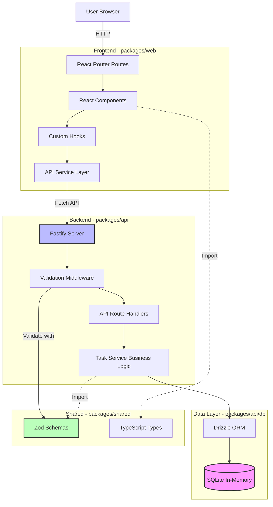

# Components

## Frontend Web Application

**Responsibility:** User-facing React application providing task management interface with inline editing, archival workflow, and multiple sorting options.

**Key Interfaces:**
- Exposes public routes: `/` (main task list), `/archived` (archived tasks view)
- Consumes REST API: `GET /api/tasks`, `POST /api/tasks`, `PUT /api/tasks/:id`, etc.
- Renders responsive UI: desktop (1280px+), tablet (768-1024px), mobile (375-767px)

**Dependencies:**
- API Service Layer (for backend communication)
- Shared Types/Schemas package (TypeScript interfaces and Zod schemas)

**Technology Stack:**
- React 19 with TypeScript
- React Router v7 (routing + data loaders)
- Vite (dev server + production bundler)
- Vanilla CSS with CSS variables

**Internal Structure:**
```
packages/web/src/
├── components/          # React UI components
│   ├── TaskList.tsx    # Main active task list
│   ├── TaskItem.tsx    # Individual task with inline edit
│   ├── AddTask.tsx     # New task input form
│   ├── ArchivedTasks.tsx # Archived tasks view
│   └── WelcomeMessage.tsx # First-time visitor banner
├── services/           # API client services
│   └── taskService.ts  # Fetch wrappers for /api/tasks
├── hooks/              # Custom React hooks
│   ├── useTasks.ts     # Task data fetching/caching
│   └── useOptimisticUpdate.ts # Optimistic UI updates
├── routes/             # React Router route components
│   ├── root.tsx        # Main layout
│   └── index.tsx       # Task list route with loader
├── styles/             # CSS files
│   ├── global.css      # CSS reset + variables
│   └── components/     # Component-specific styles
└── utils/              # Frontend utilities
    └── dateFormat.ts   # Date formatting helpers
```

## API Backend Service

**Responsibility:** RESTful API server providing task CRUD operations, validation, database persistence, and static file serving for frontend.

**Key Interfaces:**
- Exposes REST API: `/api/tasks/*` endpoints with JSON responses
- Exposes health check: `/health` for monitoring
- Serves static files: `/*` routes serve React build artifacts

**Dependencies:**
- Database Layer (Drizzle ORM)
- Shared Types/Schemas package (Zod validation schemas)

**Technology Stack:**
- Fastify 5.2.x with TypeScript
- @fastify/type-provider-zod (schema validation)
- @fastify/static (serve React build)
- @fastify/rate-limit (API protection)
- Pino (structured logging)

**Internal Structure:**
```
packages/api/src/
├── routes/             # API route handlers
│   ├── tasks.ts        # /api/tasks endpoints
│   └── health.ts       # /health endpoint
├── services/           # Business logic
│   └── taskService.ts  # Task operations (create, update, archive, etc.)
├── db/                 # Database layer
│   ├── schema.ts       # Drizzle schema definitions
│   ├── client.ts       # SQLite connection setup
│   └── migrations/     # Database migrations
├── middleware/         # Fastify middleware
│   ├── errorHandler.ts # Global error handling
│   └── validation.ts   # Zod validation middleware
├── server.ts           # Fastify app setup
└── index.ts            # Entry point, starts server
```

## Shared Package

**Responsibility:** Common TypeScript types, Zod schemas, and utilities shared between frontend and backend to prevent duplication and ensure type consistency.

**Key Interfaces:**
- Exports TypeScript interfaces: `Task`, `CreateTaskInput`, `UpdateTaskInput`
- Exports Zod schemas: `TaskSchema`, `CreateTaskInputSchema`, etc.
- Exports constants: API endpoints, validation limits

**Dependencies:**
- Zod (peer dependency for both frontend and backend)

**Technology Stack:**
- TypeScript 5.7.x
- Zod for schema definitions

**Internal Structure:**
```
packages/shared/src/
├── types/              # TypeScript type definitions
│   └── task.ts         # Task interface (deprecated, use schemas)
├── schemas/            # Zod schemas (source of truth)
│   └── task.schema.ts  # All task-related schemas
├── constants/          # Shared constants
│   └── api.ts          # API endpoint paths, limits
└── index.ts            # Public exports
```

## Database Layer (Drizzle ORM)

**Responsibility:** Type-safe database access layer providing schema definitions, query building, and migration management for SQLite in-memory database.

**Key Interfaces:**
- Exposes typed query API: `db.select()`, `db.insert()`, `db.update()`, `db.delete()`
- Manages schema: `tasks` table with columns (id, text, createdAt, archivedAt, sortOrder)
- Runs migrations: Auto-applies schema on server startup

**Dependencies:**
- better-sqlite3 (SQLite driver)
- Drizzle Kit (migration generation)

**Technology Stack:**
- Drizzle ORM 0.39.x
- SQLite 3.x (in-memory mode)

**Schema Definition:**
```typescript
// packages/api/src/db/schema.ts
import { sqliteTable, integer, text } from 'drizzle-orm/sqlite-core';

export const tasks = sqliteTable('tasks', {
  id: integer('id').primaryKey({ autoIncrement: true }),
  text: text('text').notNull(),
  createdAt: integer('created_at', { mode: 'timestamp' }).notNull(),
  archivedAt: integer('archived_at', { mode: 'timestamp' }),
  sortOrder: integer('sort_order').notNull(),
});

export type DbTask = typeof tasks.$inferSelect;
export type DbInsertTask = typeof tasks.$inferInsert;
```

## Component Interaction Diagram



**Diagram Explanation:**
- Frontend components use hooks → services → fetch API to communicate with backend
- Middleware validates requests using Zod schemas before reaching business logic
- Business logic operates on database via Drizzle ORM
- Shared package (green) provides types/schemas to both frontend and backend
- In-memory SQLite (pink) runs within backend process
