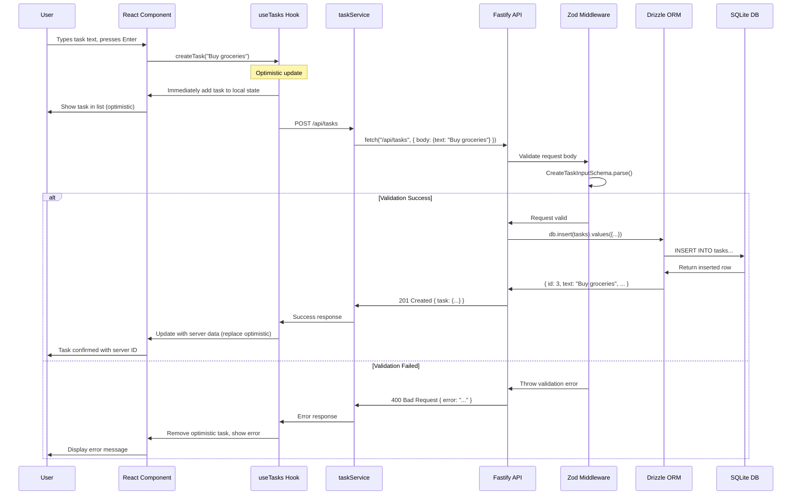
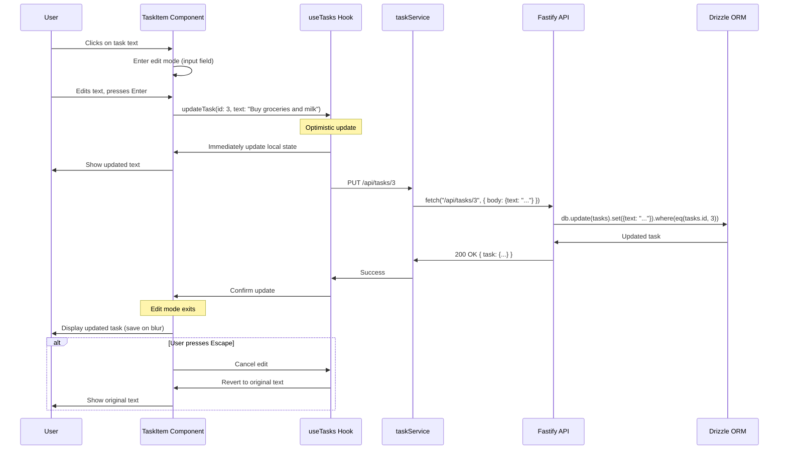
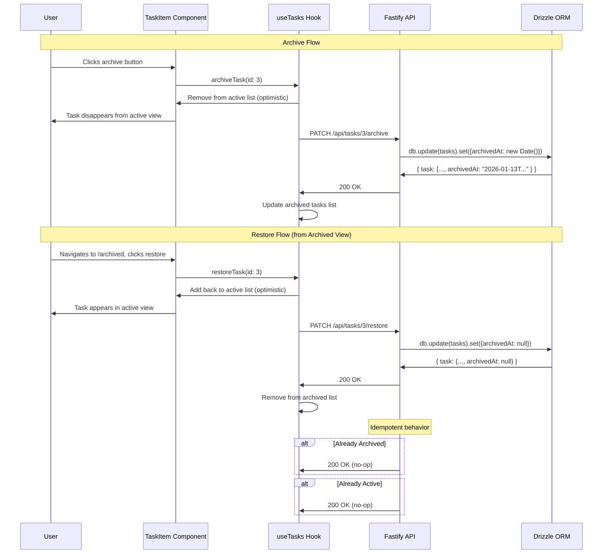
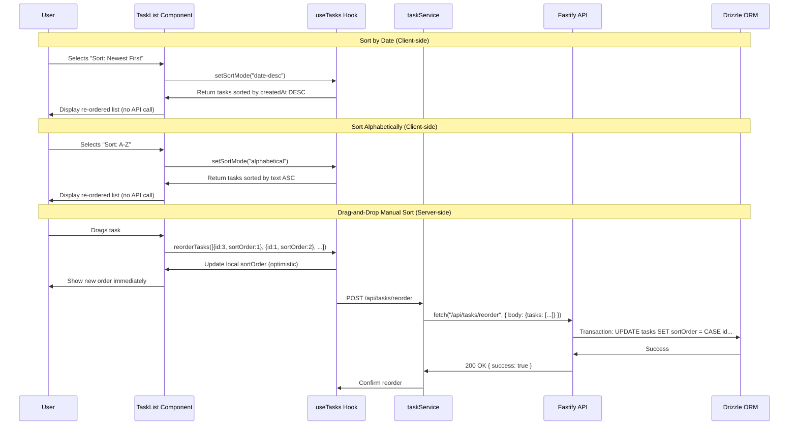
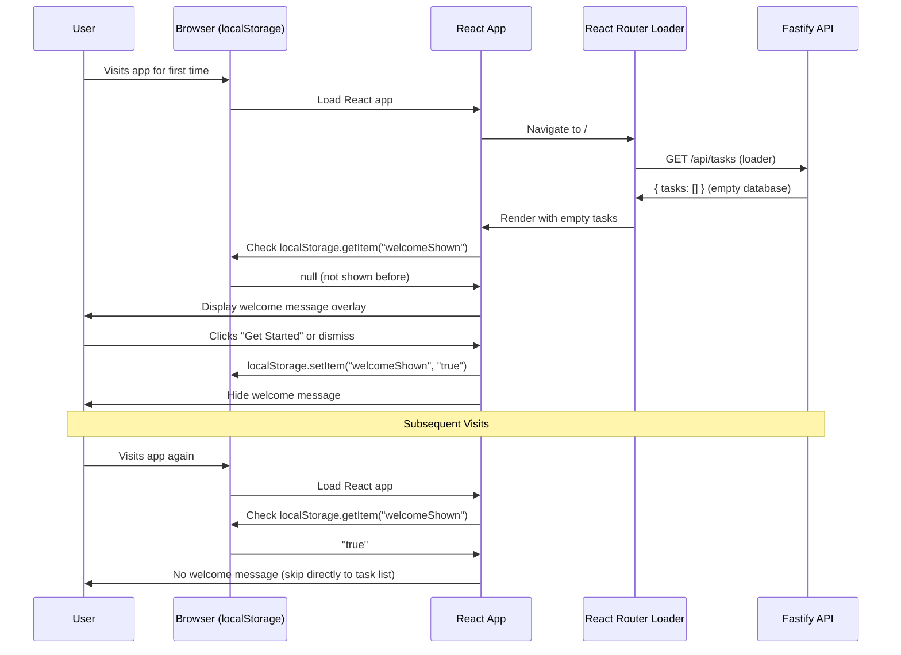
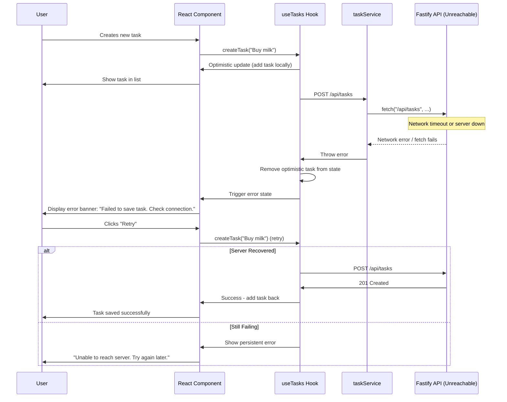

# Core Workflows

## Workflow 1: Create New Task

**Key Points:**
- **Optimistic UI Update:** Task appears immediately before server confirms (< 100ms perceived latency)
- **Zod Validation:** Request validated before reaching business logic
- **Error Recovery:** Failed requests remove optimistic update and show error
- **Auto-generated Fields:** Server assigns `id`, `createdAt`, `sortOrder` - frontend never provides these

## Workflow 2: Edit Task Inline

**Key Points:**
- **Inline Editing:** No modal dialogs - edit directly in place (FR2 requirement)
- **Save on Blur/Enter:** Saves when user clicks away or presses Enter
- **Cancel on Escape:** Pressing Escape reverts changes without API call
- **Optimistic Update:** Text changes immediately, confirmed by server

## Workflow 3: Archive and Restore Task

**Key Points:**
- **Soft Delete:** Archive sets `archivedAt` timestamp, doesn't delete from database (FR3, FR4)
- **Progressive Disclosure:** Archived tasks hidden by default, revealed via /archived route
- **Idempotent Operations:** Archiving already-archived task returns 200 (no error)
- **Reversible Actions:** Users can restore archived tasks without data loss

## Workflow 4: Sort Tasks (Three Methods)

**Key Points:**
- **Date/Alphabetical Sorting:** Client-side only, no API calls (instant response)
- **Manual Sorting:** Server-side via batch update endpoint (preserves order across sessions)
- **Batch Update:** Single `/tasks/reorder` endpoint updates multiple tasks in transaction
- **Optimistic UI:** Drag-and-drop shows new order immediately, confirmed by server

## Workflow 5: First-Time Visit with Welcome Message

**Key Points:**
- **Client-side Tracking:** localStorage tracks if welcome message shown (FR6)
- **One-time Display:** Message shown once per browser, not per session
- **No Server State:** Welcome message state is purely client-side (no database field)
- **Dismissible:** User can close message anytime via button or "X" icon

## Workflow 6: Error Handling - Network Failure

**Key Points:**
- **Optimistic Rollback:** Failed requests remove optimistic updates
- **User Feedback:** Clear error messages explain what went wrong
- **Retry Mechanism:** User can manually retry failed operations
- **Graceful Degradation:** App remains usable, explains server issues
