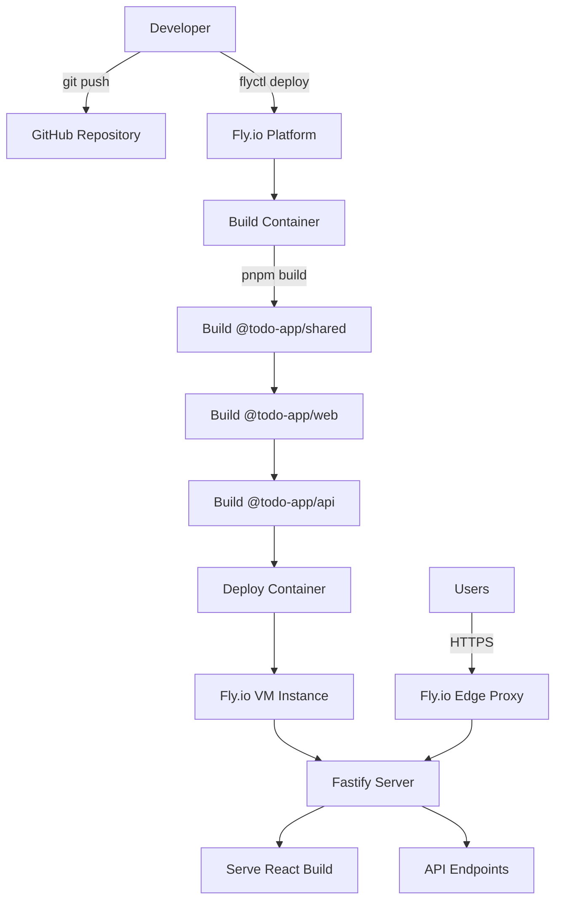

# Deployment Architecture

## Deployment Strategy

**Frontend Deployment:**
- **Platform:** Fly.io (served by Fastify, not separate frontend hosting)
- **Build Command:** `pnpm --filter @todo-app/web build`
- **Output Directory:** `packages/web/dist`
- **Served By:** Fastify static file middleware

**Backend Deployment:**
- **Platform:** Fly.io
- **Build Command:** `pnpm build` (builds shared, web, api in order)
- **Deployment Method:** Docker container via `flyctl deploy`
- **Runtime:** Node.js 24 in Docker container

**Deployment Architecture Diagram:**



## Fly.io Configuration

**fly.toml:**
```toml
app = "todo-bmad-demo"
primary_region = "iad"

[build]
  builder = "heroku/buildpacks:20"

[env]
  PORT = "8080"
  NODE_ENV = "production"

[http_service]
  internal_port = 8080
  force_https = true
  auto_stop_machines = true
  auto_start_machines = true
  min_machines_running = 0

[[http_service.checks]]
  interval = "10s"
  timeout = "2s"
  grace_period = "5s"
  method = "GET"
  path = "/health"

[[vm]]
  cpu_kind = "shared"
  cpus = 1
  memory_mb = 256
```

**Deployment Process:**

```bash
# First-time deployment
fly launch  # Creates app, configures resources

# Subsequent deployments
fly deploy  # Builds and deploys new version

# View logs
fly logs

# Check app status
fly status

# Open app in browser
fly open
```

## Environments

| Environment | Frontend URL | Backend URL | Purpose |
|------------|--------------|-------------|---------|
| **Development** | http://localhost:5173 | http://localhost:3000 | Local development |
| **Production** | https://todo-bmad-demo.fly.dev | https://todo-bmad-demo.fly.dev/api | Live environment |

**Notes:**
- No separate staging environment for MVP (2-hour constraint)
- Fly.io provides instant rollback: `fly deploy --image <previous-image>`
- Can add staging by creating second Fly.io app: `fly launch --name todo-bmad-demo-staging`
