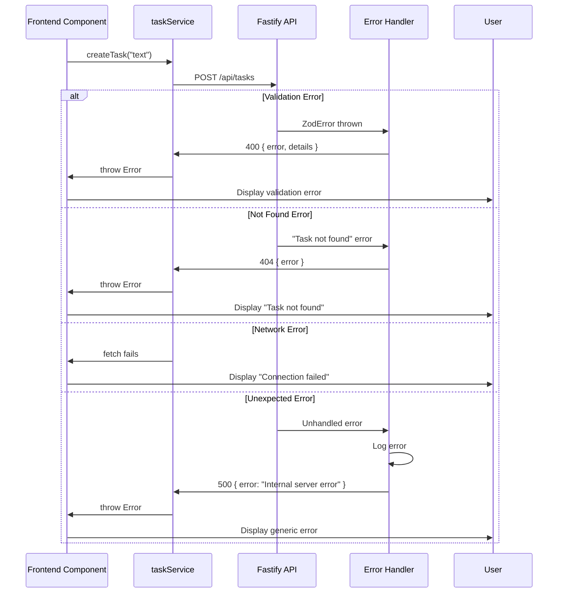

# Error Handling Strategy

## Error Flow



## Error Response Format

```typescript
interface ApiError {
  error: string;               // Human-readable error message
  details?: Record<string, any>; // Optional validation details
}

// Example validation error:
{
  "error": "Validation failed",
  "details": [
    { "path": "text", "message": "Task text is required" }
  ]
}

// Example not found error:
{
  "error": "Task not found"
}
```

## Frontend Error Handling

```typescript
// packages/web/src/hooks/useTasks.ts
const createTask = async (text: string) => {
  try {
    const newTask = await taskService.createTask(text);
    setTasks(prev => [...prev, newTask]);
  } catch (err) {
    setError(err instanceof Error ? err.message : 'Failed to create task');
    // Optionally show toast notification
    throw err; // Re-throw for component to handle
  }
};
```

## Backend Error Handling

```typescript
// packages/api/src/middleware/errorHandler.ts
export function errorHandler(error: FastifyError, request: FastifyRequest, reply: FastifyReply) {
  if (error instanceof ZodError) {
    return reply.code(400).send({
      error: 'Validation failed',
      details: error.errors.map(e => ({
        path: e.path.join('.'),
        message: e.message,
      })),
    });
  }

  if (error.message === 'Task not found') {
    return reply.code(404).send({ error: error.message });
  }

  request.log.error(error);
  return reply.code(500).send({ error: 'Internal server error' });
}
```
