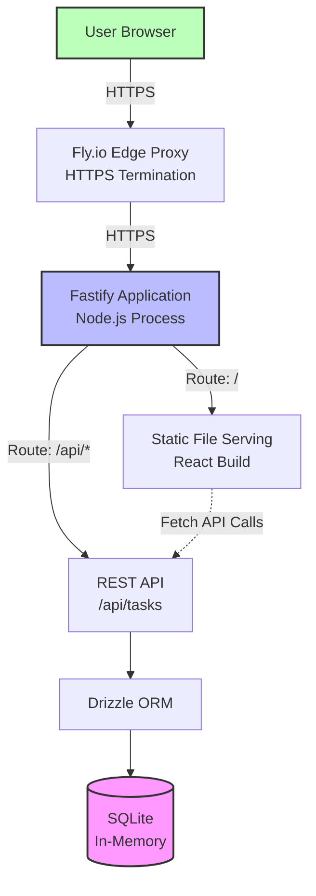

# High Level Architecture

## Technical Summary

This application follows a **monolithic fullstack architecture** deployed as a single unit to Fly.io. The frontend is a React 19 single-page application built with Vite and React Router v7, served as static files from the Fastify backend. The backend exposes a RESTful API built with Fastify, using Drizzle ORM to interface with an SQLite in-memory database. This architecture eliminates all external service dependencies—no separate database server, no CDN configuration, no authentication provider—enabling complete deployment in under 5 minutes. The monorepo structure with pnpm workspaces ensures shared TypeScript types between frontend and backend, providing end-to-end type safety across API boundaries. This design achieves the PRD's primary goal: demonstrating that structured methodology (BMAD) combined with pragmatic architectural choices enables rapid delivery of clean, functional software.

## Platform and Infrastructure Choice

Based on the 2-hour delivery constraint and portfolio demonstration goals, here are the viable options:

**Option 1: Fly.io (RECOMMENDED)**
- ✅ Zero-config HTTPS and global edge deployment
- ✅ Single `flyctl deploy` command deploys entire monolith
- ✅ Free tier sufficient for demo app ($0/month)
- ✅ Automatic health checks and restarts
- ❌ Data doesn't persist across deploys (acceptable for in-memory demo)

**Option 2: Vercel**
- ✅ Excellent DX for React deployments
- ✅ Automatic preview deployments
- ❌ Requires separate backend deployment (Vercel Serverless Functions or external API)
- ❌ Serverless architecture adds complexity vs simple Node.js server

**Option 3: Railway/Render**
- ✅ Similar simplicity to Fly.io
- ❌ Slightly more configuration overhead
- ❌ Less generous free tier

**Decision: Fly.io**

The PRD pre-selected Fly.io, and it's the optimal choice for this use case. Deploying a single Node.js process with embedded frontend is Fly.io's sweet spot.

**Platform:** Fly.io
**Key Services:**
- Fly.io compute (single VM instance)
- Automatic HTTPS via Fly.io edge proxy
- Built-in health checks and monitoring

**Deployment Host and Regions:**
- Primary region: `iad` (US East - Ashburn, Virginia) for minimal latency to likely audience
- Single region deployment (no multi-region complexity for MVP)

## Repository Structure

**Structure:** Monorepo with pnpm workspaces

**Monorepo Tool:** pnpm workspaces (fast, disk-efficient, strict dependency management)

**Package Organization:**
```
root/
├── packages/
│   ├── web/          # Frontend application (React + Vite)
│   ├── api/          # Backend application (Fastify + Drizzle)
│   └── shared/       # Shared TypeScript types and constants
├── pnpm-workspace.yaml  # Workspace configuration
├── package.json         # Root package.json
└── docs/               # BMAD documentation (PRD, architecture, stories)
```

**Rationale:**
- **pnpm over npm/yarn:** 3x faster installs, disk-efficient via content-addressable storage, strict node_modules prevents phantom dependencies
- **pnpm over Turborepo/Nx:** Workspace management only, no build orchestration overhead - critical for 2-hour constraint
- **Three-package structure:** Separates frontend, backend, and shared concerns without over-engineering
- **Shared package:** Enables importing `@todo-app/shared` types in both web and api packages, ensuring API contracts stay synchronized
- **Collocated docs:** Documentation lives in same repo as code, making this a complete portfolio artifact

## High Level Architecture Diagram



**Diagram Explanation:**
- Single Node.js process handles both static frontend and API requests
- Fly.io edge proxy provides HTTPS termination and routing
- Frontend makes client-side API calls to `/api/*` endpoints on same origin (no CORS complexity)
- In-memory database runs within the Node.js process (highlighted in pink to emphasize ephemeral nature)

## Architectural Patterns

- **Monolithic Architecture:** Single deployable unit containing frontend, backend, and database - _Rationale:_ Eliminates deployment orchestration complexity, enables 2-hour delivery, simplifies development workflow
- **Single-Page Application (SPA):** Client-side rendering with React Router for navigation - _Rationale:_ Provides instant UI feedback and smooth interactions aligned with PRD's "immediate feedback" requirement
- **RESTful API:** Standard HTTP methods (GET, POST, PUT, DELETE) for CRUD operations - _Rationale:_ Simple, well-understood pattern; no GraphQL or tRPC learning curve; sufficient for straightforward entity operations
- **Repository Pattern:** Drizzle ORM abstracts database access behind typed query interface - _Rationale:_ Enables future database migration (in-memory → file-based → PostgreSQL) without rewriting business logic
- **Optimistic UI Updates:** Frontend immediately reflects changes before server confirmation - _Rationale:_ Achieves <100ms perceived latency (NFR2) by not blocking UI on network round trips
- **API-First Component Design:** React components consume backend data exclusively via API layer, never directly accessing business logic - _Rationale:_ Maintains clean separation of concerns, enables future mobile client or API consumers
- **Shared Type Definitions:** TypeScript interfaces defined once in `@todo-app/shared`, imported by both frontend and API - _Rationale:_ Prevents drift between API contracts and frontend expectations, catch integration bugs at compile time
